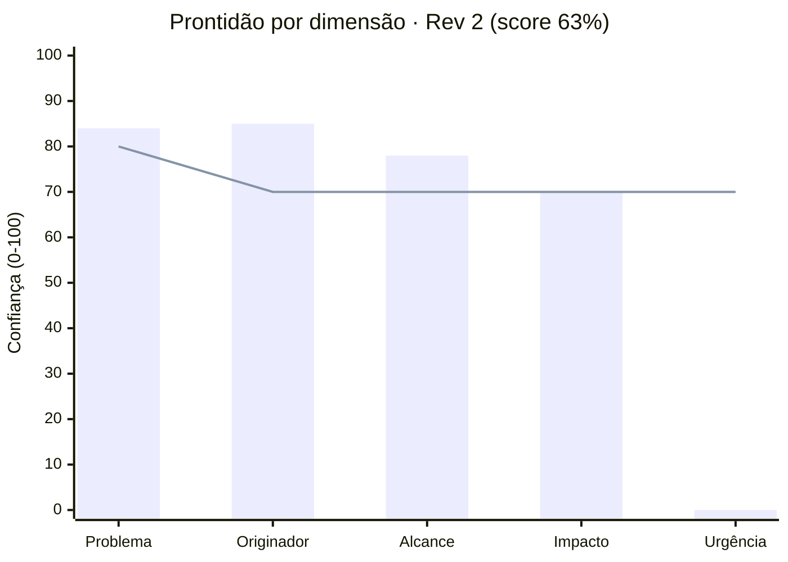
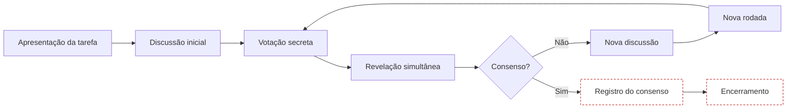
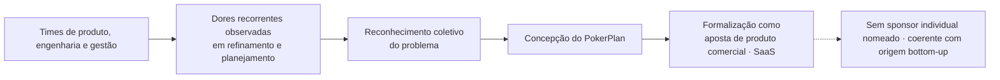
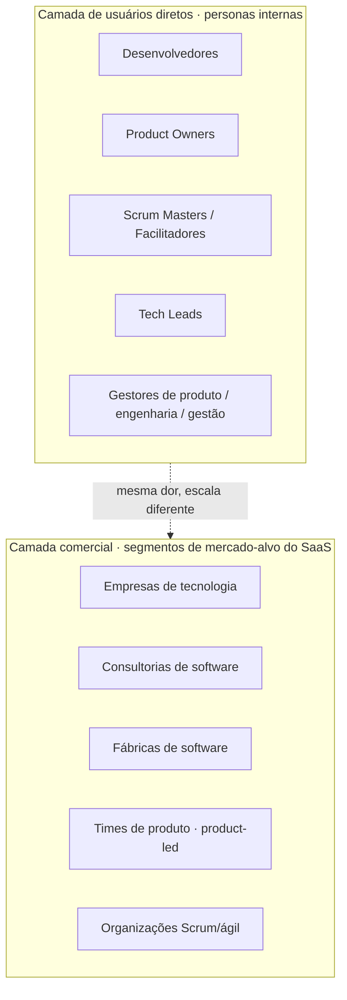
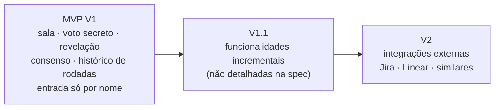
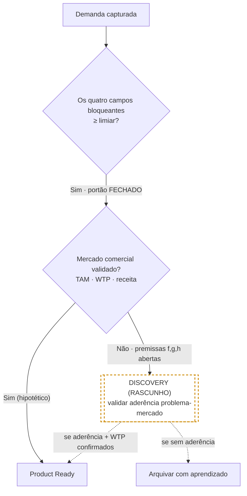
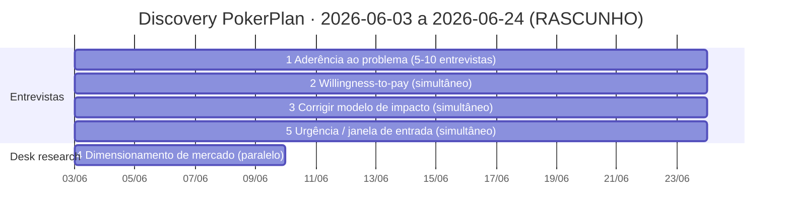
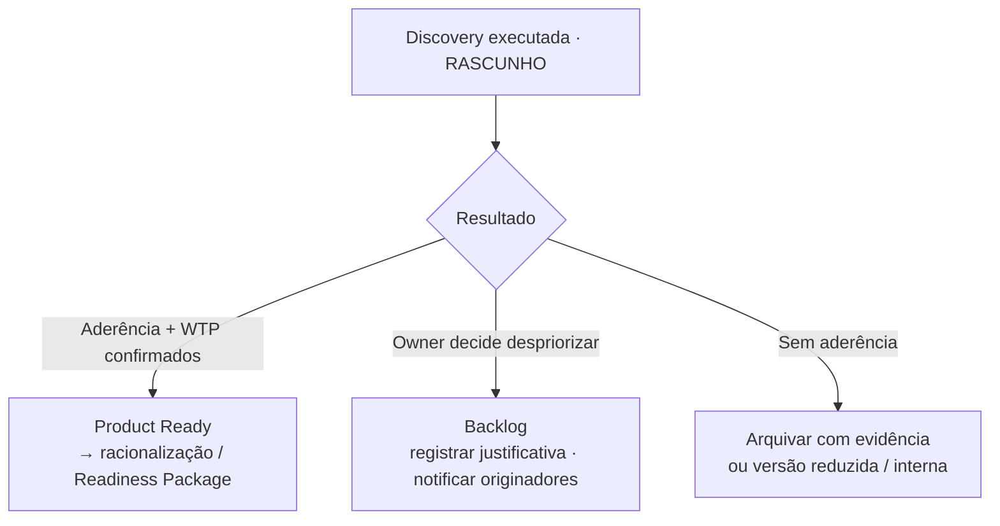

# Registro de Intake: PokerPlan

> O artefato formal de intake. Reúne a demanda capturada, registra a prontidão
> com que ela chegou e carrega um **rascunho de triagem** (decisão de
> roteamento) que está sempre marcado para aprovação humana. Este documento é
> autossuficiente.

## Metadados

| Campo | Valor |
|---|---|
| **ID do registro** | INT-2026-001 |
| **Versão** | v1 |
| **Originador (Submitter)** | Origem coletiva/bottom-up (times de produto, engenharia e gestão); formalizada como aposta de produto comercial (SaaS) |
| **Triado por (owner)** | (rascunho de IA; aguarda atribuição do owner) |
| **Data de registro** | 2026-06-03 |
| **Data de triagem** | (aguarda confirmação humana) |
| **Status** | Em triagem |
| **Idioma de saída** | pt-BR |
| **Fonte** | Especificação colada pelo Submitter (sources/pokerplan-spec.md) |

## Histórico de revisões

| Versão | Data | Evento | Resumo |
|---|---|---|---|
| v1 | 2026-06-03 | Intake redigido | Registro criado a partir da especificação fonte e da sessão de perguntas com o Submitter (Q001 a Q008). Seções bloqueantes: problema e alcance acima do limiar; originador parqueado (conf 60); impacto abaixo do limiar (conf 30, aberto). |
| v2 | 2026-06-03 | Intake atualizado (Rev 2) | Impacto atualizado com modelo de duas camadas (Q009 + Q010, conf 70, premissa + flag de discovery). Originador atualizado para origem coletiva/bottom-up (Q011, conf 85, respondido). Alcance enriquecido com segmentos de mercado comercial (Q008/Q010, conf 78). Premissas (f) a (h) adicionadas (Q005 + Q010). Prontidão recomputada: score 63 %, portão FECHADO (os quatro bloqueantes ≥ limiar). Triagem recomputada; brief de Discovery atualizado. |

---

## Prontidão recebida

> Um retrato calculado a partir das seções capturadas. Não é recapturado aqui.

| Campo | Valor |
|---|---|
| **Score de prontidão** | 63 % |
| **Requisitos bloqueantes** | Todos resolvidos por disposição honesta (portão): **Sim, FECHADO** |
| **Disposições em aberto** | 8 premissas a validar (a) a (h) · 1 flag de discovery (validação comercial/mercado em impacto) · urgência ausente (não-bloqueante) |

> **Visual · Prontidão por dimensão (barras textuais, escala 0–100).** Re-apresenta
> os valores da nota de cálculo abaixo; não introduz números novos. `■` ≈ 5 pontos.

```text
Dimensão     Conf  Limiar  Barra (0 ──────────── 100)        Portão
problema       84      80   ■■■■■■■■■■■■■■■■■                acima ✓
originador     85      70   ■■■■■■■■■■■■■■■■■                acima ✓
alcance        78      70   ■■■■■■■■■■■■■■■■                 acima ✓
impacto        70      70   ■■■■■■■■■■■■■■                   no limiar ✓
urgência        0      70   (vazio)                          abaixo · não bloqueia
─────────────────────────────────────────────────────────────────
Prontidão = (84+85+78+70+0) / 5 = 317/5 = 63 %        Portão: FECHADO
```

> **Visual · Prontidão por dimensão (gráfico Mermaid, escala 0–100).** Os mesmos
> valores da tabela acima; **barras** = confiança registrada por dimensão,
> **linha** = limiar mínimo de cada dimensão. Renderiza no GitHub e em editores
> Mermaid modernos (`xychart-beta`); a coluna Portão permanece na tabela acima.



> **Nota de cálculo (Rev 2):** a fórmula é a média simples dos 5 campos de captura gradeados = (problema + originador + alcance + impacto + urgência) / 5.
> - problema: 84 / min 80 · **acima** ✓
> - originador: 85 / min 70 · **acima** ✓ (atualizado via Q011, de conf 60 parqueado para conf 85 respondido)
> - alcance: 78 / min 70 · **acima** ✓ (atualizado via Q008/Q010, de conf 72 para conf 78)
> - impacto: 70 / min 70 · **no limiar** ✓ (atualizado via Q009/Q010, de conf 30 inferido para conf 70 premissa; libera o portão honestamente)
> - urgência: 0 / min 70 · abaixo, mas não bloqueia o portão
>
> Score: (84 + 85 + 78 + 70 + 0) / 5 = 317 / 5 = **63 %**
>
> **Portão:** FECHADO. Os quatro campos bloqueantes (problema, originador, alcance, impacto) atendem ou superam seu limiar de confiança. Urgência permanece sem resposta (não-bloqueante); o impacto comercial/mercado é flag de discovery explícita, não gap de captura. Rascunho, pendente de confirmação humana.

---

## Demanda consolidada

> Leitura da demanda em uma tela, com cada dimensão carregando a confiança que herdou.

### Problema (a dor, não a solução)

A dor principal não é a votação em si, mas a **falta de estrutura e rastreabilidade no processo de estimativa de tarefas em equipes ágeis**. As sessões de Planning Poker acontecem de forma improvisada, com ferramentas que não foram projetadas para isso.

**Sintomas observáveis recorrentes:**
- Perda de tempo organizando a dinâmica da votação (operação manual em vez de facilitação).
- Falta de registro das estimativas: não há histórico consolidado das sessões.
- Dificuldade em acompanhar a evolução do consenso dentro de uma sessão e entre sessões.
- Ausência de histórico para entender por que uma tarefa recebeu certa estimativa. As equipes precisam repetir discussões porque a sessão anterior não ficou registrada.
- Votos influenciados involuntariamente: quando a votação não é realmente secreta, os participantes influenciam os demais antes da revelação.
- Fragmentação entre várias ferramentas (chamadas de vídeo, chats, planilhas, soluções de Planning Poker sem integração), o que gera retrabalho e perda de contexto.

**Workaround atual e o que ele não entrega:** o processo é conduzido com chamadas de vídeo, chats corporativos, planilhas para registrar resultados e soluções gratuitas de Planning Poker desconectadas do restante do processo. Essas abordagens resolvem apenas a votação pontual, não o fluxo completo. Falta histórico consolidado das sessões, registro das rodadas por tarefa, justificativas para divergências, exportação de resultados, organização das tarefas estimadas, integração com ferramentas de gestão de produto e visibilidade da evolução das estimativas ao longo do tempo.

**Síntese:** a estimativa, que deveria ser rápida e colaborativa, vira uma atividade operacionalmente desgastante, pouco rastreável e difícil de reproduzir. O motivo não é falta de método, e sim falta de uma ferramenta adequada para conduzi-lo.

> **Visual · Fluxo do Planning Poker tradicional (contexto descritivo da fonte).**
> Re-apresenta o método clássico citado como pano de fundo da dor; não acrescenta
> etapas além das descritas. Mostra onde o workaround atual perde rastro.



> Leitura do visual: o método em si funciona; o que o workaround atual não entrega
> é a persistência das etapas tracejadas (registro do consenso e histórico de
> rodadas), origem da falta de rastreabilidade.

`Confiança:` 84 · `Fonte:` Submitter direto (Q006 + Q007) · `Status:` respondido · `Disposição:` respondido · `Dica:` Dor descrita com sintomas observáveis e sem prescrever solução, o que atende o critério. Ainda não quantificada (tempo perdido por sessão, número de sessões): a quantificação pertence a `impacto`.

### Originador e contexto

A iniciativa do PokerPlan tem **origem coletiva e bottom-up**: partiu dos próprios membros dos times de produto, engenharia e gestão que vivenciam o processo de estimativa de forma recorrente. Ao longo de sessões de refinamento e planejamento, esses participantes demonstraram insatisfação crescente com a condução do processo via ferramentas improvisadas ou soluções incompletas.

**Reclamações recorrentes que motivaram a iniciativa:**
- Falta de rastreabilidade das estimativas.
- Dificuldade de registrar decisões tomadas nas sessões.
- Ausência de histórico das rodadas de votação.
- Pouca integração com o fluxo de trabalho existente.

Dessas dores recorrentes surgiu, entre os próprios participantes, a discussão sobre a necessidade de uma ferramenta mais adequada para suportar o Planning Poker de forma estruturada. Esse reconhecimento coletivo do problema motivou conceber o PokerPlan, que depois foi **formalizado como aposta de produto comercial (SaaS)**, já que o mesmo problema é amplamente distribuído entre equipes de tecnologia ágil e não se restringe a um time ou empresa.

**Canal/situação:** concepção interna de produto, a partir de dor observada coletivamente. Não há um sponsor individual nomeado, o que é coerente com a origem bottom-up e não é uma lacuna. Pode ser confirmado se for necessário para o handoff.

> **Visual · Caminho da demanda (origem coletiva → aposta de produto).** Re-apresenta
> a narrativa de originação descrita acima; sem fatos novos.



`Confiança:` 85 · `Fonte:` Submitter direto (Q011, 2026-06-03) · `Status:` respondido · `Disposição:` respondido · `Dica:` Originador bem caracterizado: origem bottom-up (times de produto, engenharia e gestão), formalizada como aposta de produto comercial. Fecha o portão do originador (≥ 70). Sponsor individual (pessoa) não nomeado, mas não bloqueia; pode ser confirmado se necessário para o handoff.

### Quem é impactado (alcance)

A dor é percebida principalmente por **equipes de desenvolvimento de software que usam métodos ágeis** e fazem estimativas de backlog regularmente. A demanda tem duas camadas: personas internas (usuários diretos) e segmentos de mercado comercial (organizações que comprariam o produto SaaS).

> **Visual · Duas camadas do alcance (personas internas × segmentos de mercado).**
> Re-apresenta a estrutura de duas camadas descrita nas tabelas a seguir.



**Personas internas afetadas e como cada uma é impactada:**

| Persona | Como é afetada |
|---|---|
| **Desenvolvedores** | Participam das sessões de votação; sofrem com a falta de sigilo do voto, com a ausência de histórico e com o tempo operacional perdido. |
| **Product Owners (PO)** | Conduzem ou participam das sessões; perdem rastreabilidade das estimativas passadas e contexto para a priorização futura. |
| **Scrum Masters / Facilitadores** | Gerenciam a dinâmica da sessão; hoje fazem isso de forma manual e fragmentada, sem ferramenta dedicada. |
| **Tech Leads** | Participam de votações técnicas; precisam de histórico para justificar estimativas e comparar rodadas. |
| **Gestores de produto / Engenharia / Gestão** | Dependem das estimativas para o planejamento; ficam sem visibilidade da evolução, sem dados consolidados e sem integração com ferramentas de gestão. |

**Segmentos de mercado comercial (organizações-alvo do SaaS):**

| Segmento | Caracterização |
|---|---|
| **Empresas de tecnologia** | Squads internos de desenvolvimento com backlog regular; frequência mais alta de sessões de estimativa. |
| **Consultorias de software** | Múltiplos times, múltiplos clientes; precisam de rastreabilidade e histórico por projeto. |
| **Fábricas de software** | Alto volume de sessões; precisam padronizar o processo entre times. |
| **Times de produto (product-led companies)** | Estimativa frequente ligada a ciclos de produto; precisam de integração com ferramentas de gestão (Jira, Linear). |
| **Organizações Scrum/ágil** | Qualquer organização que adotou Scrum ou métodos ágeis com rituais de estimativa recorrentes. |

> **Nota de escopo:** personas e segmentos identificados e confirmados pelo Submitter (Q008 + Q010). **Sem dimensionamento de TAM**: quantos times, quantas organizações, número de orgs no mercado endereçável: nada disso foi quantificado. O dimensionamento de mercado (TAM) é item de discovery.

`Confiança:` 78 · `Fonte:` Submitter direto (Q008, personas 2026-06-03; segmentos de mercado via Q010, 2026-06-03) · `Status:` respondido · `Disposição:` respondido · `Dica:` Personas claras (Devs, PO, SM, Tech Lead, gestores) e segmentos de mercado claros (empresas tech, consultorias, fábricas de software, times de produto, organizações Scrum/ágil). SEM dimensionamento de TAM: quantos times, quantas organizações, nº de orgs no mercado endereçável; isso permanece não-quantificado e é item de discovery.

### Impacto de negócio

O impacto de negócio tem **duas camadas distintas**, com graus diferentes de validação.

> **Visual · Impacto em duas camadas (estado de validação).** Re-apresenta a
> separação de camadas descrita abaixo; nenhum valor de economia é afirmado aqui.

| Camada | O que representa | Estado de validação | Sinalização |
|---|---|---|---|
| **A · Eficiência operacional por cliente** | Modelo de horas-homem por sessão/squad e ganho por redução de ineficiência | **Modelo estimado** (premissa, conf 70) — libera o portão honestamente | Contém inconsistência aritmética **a validar** na Discovery |
| **B · Oportunidade comercial (SaaS)** | Mercado endereçável e monetização provável do produto | **NÃO validada** — sem TAM, sem projeção de receita, sem willingness-to-pay | Premissa de mercado · item explícito de Discovery |

---

### Camada A · Eficiência operacional por cliente (modelo estimado)

Baseado em uma aproximação do Submitter para equipes ágeis tradicionais (Q009):

**Modelo de horas-homem:**

| Variável | Valor assumido |
|---|---|
| Tamanho do time | 8 pessoas |
| Duração da sessão | ~1 h |
| Frequência | ~4 sessões/mês por time |
| Horas-homem por sessão | 8 h-h |
| Horas-homem/mês por time | 32 h-h/mês |
| Org com 10 squads | ~320 h-h/mês em estimativa |

O problema não é a existência dessas horas (estimar é necessário), e sim o **desperdício por falta de estrutura**: ausência de histórico, repetição de discussões não documentadas, dificuldade de registrar decisões e fragmentação de ferramentas.

**Ganho estimado com redução de ineficiência:**
- Reduzindo 15 a 20 min de ineficiência por sessão, um squad economizaria horas-homem/ano por time (valor exato a confirmar; ver inconsistência aritmética abaixo).
- Em orgs com dezenas de squads, o ganho acumulado é significativo.

**Benefício adicional (menos visível, mais relevante):** melhoria da **qualidade e previsibilidade das estimativas**. Com decisões registradas e divergências rastreáveis, o time evolui o processo e reduz desalinhamentos. Visão do produto: PokerPlan como ferramenta de **governança e rastreabilidade** do processo de estimativa, não apenas de votação.

> **Inconsistência aritmética a validar:** 15 a 20 min × ~48 sessões/ano × 8 pessoas = ~96 a 128 h-h/ano por squad. O Submitter citou "8 a 11 h-h/ano", e há uma discrepância (a base do cálculo de economia precisa ser confirmada antes de usar o número em materiais de triagem). Esta inconsistência não bloqueia o portão, mas deve ser resolvida na Discovery.

> **Visual · A inconsistência aritmética (a validar, não resolver).** Re-apresenta os
> dois valores em conflito exatamente como a fonte os registra; nenhum é adotado
> como número de economia.

```text
   Cálculo derivado das premissas        Valor citado pelo Submitter
   15–20 min × ~48 sessões × 8 pessoas    "8 a 11 h-h/ano por squad"
   ≈ 96 a 128 h-h/ano por squad
            │                                        │
            └──────────────  DISCREPÂNCIA  ──────────┘
                   Base do cálculo a confirmar na Discovery
                   (não bloqueia o portão · não usar em triagem)
```

---

### Camada B · Oportunidade comercial (produto SaaS) · NÃO VALIDADA

O PokerPlan está sendo concebido como **produto comercial SaaS** (Q010). O problema é amplamente distribuído entre equipes de tecnologia ágil e não se restringe a um time ou empresa.

**Mercado potencial:**
- Equipes de desenvolvimento de software, empresas de tecnologia, consultorias de software, fábricas de software, times de produto, organizações Scrum/ágil.

**Monetização provável:**
- SaaS por organização, com planos por nº de usuários, equipes ou funcionalidades avançadas.

**Estado atual da validação comercial:**
- **Sem validação formal de mercado.**
- **Sem projeções de receita.**
- **Sem TAM quantificado.**
- O objetivo declarado pelo Submitter é: "validar se existe aderência suficiente ao problema para justificar evoluir para produto comercial."

> Esta camada é uma **premissa de mercado a validar**, não uma projeção. Nenhuma projeção de receita nem validação de aderência foi feita. É item explícito de Discovery.

`Confiança:` 70 · `Fonte:` Submitter direto (Q009 + Q010, 2026-06-03) · `Status:` parqueado · `Disposição:` premissa (eficiência: modelo estimado, conf 70, libera portão honestamente) + flag de discovery (validação comercial/mercado: explicitamente não-validada) · `Dica:` Modelo de eficiência é estimativa, não medição real; libera o portão como premissa conf 70. INCONSISTÊNCIA ARITMÉTICA: 15 a 20 min × ~48 sessões/ano × 8 pessoas ≈ 96 a 128 h-h/ano por squad (vs. "8 a 11 h-h/ano" citado pelo Submitter); confirmar base do cálculo. Validação comercial (TAM, aderência ao problema, projeção de receita, willingness-to-pay) é item de Discovery, não gap de captura.

### Urgência · por que agora

Sem resposta capturada. O Submitter não declarou nenhuma janela, prazo, competidor chegando ou custo de espera.

`Confiança:` 0 · `Fonte:` (vazio) · `Status:` aberto · `Disposição:` (vazio) · `Dica:` "Por que agora" não foi declarado. Perguntar ao Submitter: há um prazo, um competidor, um evento de mercado, ou um custo que cresce a cada mês sem solução? Sem urgência declarada, a triagem tende a Backlog ou Discovery; isso não invalida a demanda, mas enfraquece a prioridade.

### Prioridade declarada

**Nível:** Não declarado pelo Submitter. **Motivo:** o Submitter não declarou prioridade relativa. O documento sugere um escalonamento de escopo implícito:

- **MVP V1** (maior prioridade implícita): fluxo essencial. Criar sala, votar com sigilo, revelar, registrar consenso, histórico de rodadas, entrada sem autenticação (só nome).
- **V1.1**: funcionalidades incrementais (não detalhadas na especificação).
- **V2**: integrações externas (Jira, Linear e similares).

> **Visual · Escalonamento de escopo por versão (não é prioridade de negócio).**
> Re-apresenta os escopos descritos acima; reforça a ressalva da nota seguinte.



> Atenção: isso é **priorização de escopo** (o que entra em qual versão), não nível de prioridade de negócio em relação a outros projetos da organização. Confirmar com o Submitter se há prioridade relativa a declarar.

---

## Triagem · decisão de roteamento

> ⚠️ **RASCUNHO DE TRIAGEM · gerado por IA a partir da captura, pendente de confirmação do owner.**
> Os veredictos e o roteamento abaixo são uma *proposta* fundamentada na evidência
> capturada, não uma decisão final. Um owner humano deve revisar, ajustar e aprovar.
> Até lá, o `Status` permanece *Em triagem* e a disposição desta seção é de baixa confiança.

### Critérios avaliados

| # | Critério | Veredicto | Justificativa | Base / fonte |
|---|---|---|---|---|
| 1 | É um problema real (não um sintoma isolado)? | **Sim** | Dor descrita com múltiplos sintomas observáveis (falta de sigilo real, ausência de histórico, fragmentação de ferramentas, retrabalho, repetição de discussões). Não é desejo de feature: é dor existente no processo atual, descrita pelo Submitter com experiência direta. | Q006 + Q007, Submitter direto, conf 84 |
| 2 | É recorrente / tem volume? | **Sim (assumido)** | O Submitter descreve recorrência observada coletivamente em times de produto, engenharia e gestão (Q011). Origem bottom-up: múltiplos times reclamaram. Mas sem dimensionamento (quantos times, frequência por semana): recorrência plausível, porém não quantificada. | Q008 conf 78; Q011 conf 85; premissas (e) e (h) |
| 3 | Encaixa na visão de produto? | **Sim (assumido)** | Produto comercial SaaS para equipes ágeis; Planning Poker é prática estabelecida no mercado; visão explicitada pelo Submitter (Q010). Alinhamento assumido, sem visão de produto formalizada acessível para verificação independente. | Q010, Submitter direto, conf 80; fonte: sources/pokerplan-spec.md |
| 4 | Impacto técnico e de negócio? | **Médio (modelado, comercialmente não validado)** | Eficiência operacional modelada (Q009): 32 h-h/mês por squad, ganho por redução de ineficiência: premissa conf 70, libera o portão honestamente. Oportunidade comercial (Q010): produto SaaS com mercado endereçável declarado. Porém: (a) há inconsistência aritmética no modelo de economia a resolver; (b) validação de aderência problema-mercado, TAM e willingness-to-pay estão explicitamente ausentes, e isso é item de Discovery. | Q009 conf 70 (premissa); Q010 conf 80; premissas (f) a (h) |
| 5 | Urgência e impacto justificam *agora*? | **Parcial (impacto modelado; urgência ausente)** | Impacto operacional modelado a conf 70, o que justifica investigação. Oportunidade comercial real, mas não validada. Urgência: sem janela, prazo, competidor ou custo de espera declarados (conf 0, não-bloqueante). O próprio Submitter declarou que o objetivo é "validar aderência ao problema antes de evoluir para produto comercial", o que alinha com Discovery, não com Product Ready imediato. | Urgência conf 0; impacto conf 70 premissa; Q010 Submitter direto |

> **Visual · Lógica do roteamento (RASCUNHO).** Re-apresenta a decisão proposta a partir
> dos critérios acima; é um rascunho de IA pendente de confirmação do owner.



### Decisão

| Campo | Valor |
|---|---|
| **Decisão** | **Discovery** (RASCUNHO) |
| **Justificativa** | O problema é real e bem descrito (conf 84), o alcance é claro, com personas e segmentos de mercado identificados (conf 78), o originador está resolvido com origem bottom-up coletiva (conf 85), e o impacto operacional está modelado como premissa (conf 70, libera o portão honestamente). Os quatro campos bloqueantes estão acima do limiar. Ainda assim, o roteamento correto é **Discovery**, não por gaps de captura, mas pela natureza do estágio do produto: (1) o mercado comercial está explicitamente NÃO validado (sem TAM, sem willingness-to-pay, sem projeção de receita; premissas f, g, h); (2) o modelo de eficiência contém inconsistência aritmética a resolver; (3) o próprio Submitter declarou que o objetivo inicial é "validar aderência ao problema" antes de escalar para produto comercial. Discovery aqui não é sinal de fragilidade da demanda: é o passo honesto para validar a aderência problema-mercado antes de comprometer capacidade de desenvolvimento. Se a Discovery confirmar aderência e resolver as premissas comerciais, o re-triage para Product Ready é imediato. |
| **Reversível?** | Sim |
| **Originador notificado** | Pendente (ação humana; data a definir) |

---

## Escalação arquitetural

**Necessária:** Não (RASCUNHO). O MVP V1 é uma extensão de UI/estado com regras de negócio bem definidas (RN-001 a RN-010), sem pagamentos, sem multi-tenancy complexo, sem AI/runtime, sem integrações externas (as integrações Jira/Linear ficam para V2). A premissa de "entrada sem autenticação" (MVP V1) simplifica a superfície de segurança. As suposições técnicas remanescentes (estado em tempo real para múltiplos participantes simultâneos, premissa a) são de viabilidade e pertencem à racionalização pelo Tech Lead, não a uma escalação arquitetural antes do congelamento de escopo. Pendente de confirmação do owner.

---

## Premissas

> Condições assumidas como verdadeiras na captura. Cada uma carrega um veredicto proposto (rascunho) e quem a valida. Se uma se provar falsa, a demanda é re-triada.

| Premissa | Veredicto (rascunho) | Validar com |
|---|---|---|
| (a) Sessões são remotas e síncronas, com participantes conectados ao mesmo tempo | A validar: material para a arquitetura de estado em tempo real; se for async, o modelo muda | Submitter |
| (b) Sem autenticação no MVP V1; identificar-se por nome basta para o caso de uso inicial | A validar: pode ser preferência de design, não restrição permanente; confirmar se há requisito de identidade futura | Submitter |
| (c) As escalas relevantes são Fibonacci e T-Shirt (customizáveis); outras escalas são secundárias | Aceita: risco baixo; padrão da indústria para Planning Poker; confirmável em build | Submitter |
| (d) Integrações com Jira, Linear e similares ficam para V2; o MVP V1 não depende delas | Aceita: declarado explicitamente na especificação como V2; baixo risco de reversão | Submitter (confirmar escopo V2) |
| (e) O público-alvo são equipes ágeis que já praticam Planning Poker; não há onboarding de método novo | A validar: impacta posicionamento e copy do produto; se for público novo, o onboarding muda | Submitter |
| (f) Monetização provável = SaaS por organização, com planos por nº de usuários, equipes ou funcionalidades avançadas | A validar: modelo de monetização declarado pelo Submitter, mas não testado com potenciais clientes; willingness-to-pay desconhecido | Submitter / Discovery |
| (g) NÃO há validação formal de mercado nem projeção de receita; premissa de que há aderência suficiente ao problema, a confirmar | A validar: premissa central para a viabilidade comercial; risco alto se a aderência for menor do que o esperado | Discovery (entrevistas / testes de mercado) |
| (h) O problema é amplamente distribuído entre times ágeis (base de mercado grande o suficiente para sustentar um SaaS) | A validar: premissa de mercado; distribuição qualitativa observada pelo Submitter, mas sem dados de TAM/SAM/SOM | Discovery (market sizing) |

---

## Restrições

> Condições que limitam o espaço de solução, a respeitar independentemente do que for construído.

| Restrição | Tipo | Nota |
|---|---|---|
| RN-001: Sigilo do voto (votação secreta) até a revelação; o progresso exibe apenas a contagem de votos, não os valores | Técnica / Escopo | Regra de negócio central do Planning Poker; violá-la destrói o propósito do método |
| RN-002: Voto alterável apenas com a rodada aberta; sem voto retroativo após o encerramento | Técnica / Escopo | Garante a integridade da rodada |
| RN-003: Controle exclusivo do Host para revelar votos | Escopo | O Host/Facilitador é o único autorizado a revelar |
| RN-005: Controle exclusivo do Host para encerrar rodadas | Escopo | Mesmo princípio: controle de fluxo da sessão |
| RN-006: Múltiplas rodadas por tarefa permitidas | Escopo | Suporta a re-votação após discussão |
| RN-007: Histórico completo de todas as rodadas | Técnica / Escopo | A rastreabilidade é um objetivo central do produto |
| RN-008: Sem voto retroativo após o encerramento da rodada | Técnica / Escopo | Complementa a RN-002 |
| RN-009: Controle exclusivo do Host para cancelar rodadas | Escopo | Consistência do controle do Facilitador |
| RN-010: Estimativa final registrada separada dos votos individuais; o consenso não precisa ser a média | Escopo | Facilita o registro do valor acordado pelo grupo |
| Entrada sem autenticação (MVP V1): participantes identificados apenas por nome | Técnica / Escopo | Simplifica o onboarding; confirmar se é restrição permanente ou só do MVP |
| Preservar as regras do Planning Poker físico | Escopo | O produto é uma versão digital fiel do método existente |

`Confiança:` 80 · `Fonte:` sources/pokerplan-spec.md §"Regras de Negócio" RN-001 a RN-010, §"Fluxo Digital", §"Objetivo do Produto" (Q001) · `Status:` respondido · `Disposição:` inferido · `Dica:` Confirmar com o Submitter quais são restrições rígidas vs. preferências de design, especialmente "sem autenticação" (pode ser só MVP V1, não permanente) e quais RNs são inegociáveis vs. configuráveis.

---

## Brief de Discovery

> Preenchido porque o rascunho de triagem propõe **Discovery**. O foco é validar a aderência problema-mercado e resolver as premissas comerciais declaradas pelo Submitter, não coletar mais dados de captura (os campos bloqueantes estão todos acima do limiar). Pendente de confirmação do owner antes de abrir formalmente.
>
> **Objetivo central:** confirmar se existe aderência suficiente ao problema no mercado endereçável para justificar evoluir o PokerPlan para produto comercial (SaaS). Este é o próprio objetivo declarado pelo Submitter (Q010).

> **Visual · Time-box da Discovery (RASCUNHO, 3 semanas).** Re-apresenta o sequenciamento
> e os time-boxes descritos no brief abaixo; um rascunho pendente de confirmação.



| # | Incógnita / hipótese a testar | Owner | Método sugerido | Time-box |
|---|---|---|---|---|
| 1 | **Aderência ao problema (problem-market fit):** o problema de falta de estrutura/rastreabilidade em estimativas ágeis é sentido com intensidade suficiente por potenciais clientes para que paguem por uma solução? | Submitter / produto | Entrevistas de descoberta com 5 a 10 pessoas representando os segmentos-alvo (tech, consultoria, fábricas de software); foco em dor, workarounds e disposição para mudar | 2 a 3 semanas |
| 2 | **Willingness-to-pay / validação de monetização:** potenciais clientes pagariam por uma ferramenta SaaS de Planning Poker com histórico, rastreabilidade e integração? Em qual faixa de preço? | Submitter / produto | Teste de conceito / landing page com proposta de valor + formulário de interesse; ou perguntas diretas nas entrevistas (item 1) | Simultâneo ao item 1; 2 a 3 semanas |
| 3 | **Validação e correção do modelo de impacto operacional:** resolver a inconsistência aritmética (15 a 20 min × ~48 sessões × 8 pessoas ≈ 96 a 128 h-h/ano vs. "8 a 11 h-h/ano" citado); obter dados reais de frequência e duração de sessões de potenciais usuários | Submitter / produto | Perguntas específicas nas entrevistas (item 1): "Quantas sessões por sprint/mês? Quanto dura cada uma? Qual parte você considera ineficiente?" | Simultâneo ao item 1 |
| 4 | **Dimensionamento de mercado (TAM/ordem de grandeza):** quantas organizações no Brasil/global praticam Planning Poker com frequência? Qual o segmento de maior penetração inicial? | Submitter / produto | Pesquisa desk (dados de adoção de Scrum/ágil, surveys do mercado: State of Agile, etc.); estimativa de ordem de grandeza (não precisa ser exata neste estágio) | 1 semana paralela |
| 5 | **Urgência / janela de entrada:** há uma janela de mercado, um evento ou um custo de espera que justifique agir agora vs. em 2 a 3 meses? (Competidores chegando? Demanda reprimida crescendo?) | Submitter | Análise dos competidores existentes; pergunta direta nas entrevistas sobre as ferramentas atuais e a satisfação com elas | Simultâneo ao item 1 |

**Owner sugerido:** Submitter / time de produto.

**Time-box total:** 3 semanas (2026-06-03 a 2026-06-24). Os itens 1 a 3 podem ser cobertos em uma rodada de 5 a 10 entrevistas de 30 a 45 min cada. O item 4 pode ser paralelo (pesquisa desk). Se os itens 1 a 3 confirmarem aderência e willingness-to-pay, o re-triage para **Product Ready** é imediato, sem nova rodada de intake completa.

**Critério de saída da Discovery (para re-triage):** (a) pelo menos 5 entrevistas realizadas com personas do segmento-alvo; (b) evidência qualitativa de que a dor é real e há disposição para pagar; (c) modelo de impacto operacional corrigido com dados reais; (d) premissas (f) a (h) revisadas com base nas entrevistas.

---

## Handoff

- **Se Discovery (proposta atual, RASCUNHO):** executar o brief de Discovery acima. Objetivo: validar a aderência problema-mercado e a willingness-to-pay e corrigir o modelo de impacto operacional. Time-box: 3 semanas. Ao fechar os critérios de saída definidos no brief, o re-triage para **Product Ready** é imediato, sem nova rodada de intake completa.
- **Se o owner re-triar para Product Ready após a Discovery:** prosseguir para a racionalização (Readiness Package). Todos os campos bloqueantes já estão acima do limiar; a racionalização focará nas premissas técnicas (a) a (e) e nas premissas comerciais confirmadas pela Discovery. A urgência pode ser reavaliada se a Discovery revelar uma janela de mercado.
- **Se o owner re-triar para Backlog:** registrar a justificativa e notificar os originadores (times de produto, engenharia e gestão que levantaram a demanda coletivamente).
- **Se a Discovery revelar ausência de aderência:** registrar o aprendizado, arquivar a demanda com evidência, e decidir se ela volta como versão reduzida (ferramenta interna) ou é descartada.

> **Visual · Caminhos de re-triage após a Discovery (RASCUNHO).** Re-apresenta as quatro
> ramificações descritas acima; rascunho pendente de ação do owner.



> ⚠️ **Ação imediata:** o owner deve (1) confirmar ou ajustar o rascunho de triagem acima, (2) atribuir-se como triador e registrar a data de triagem nos Metadados, (3) abrir o brief de Discovery com o Submitter/time de produto e agendar o início das entrevistas de descoberta. Esta demanda não está em Discovery por gaps de captura (todos fechados); está em Discovery por ser o próximo passo honesto antes de comprometer capacidade de desenvolvimento em um mercado ainda não validado.

<!-- END OF DOCUMENT -->
