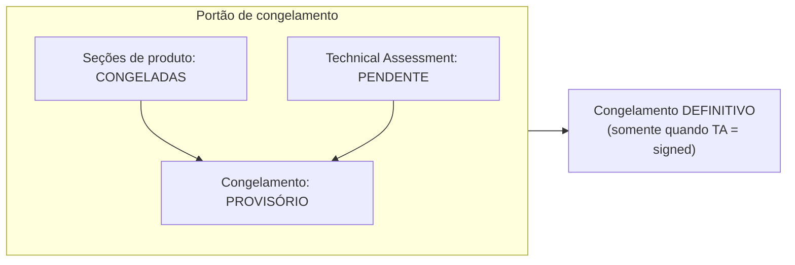
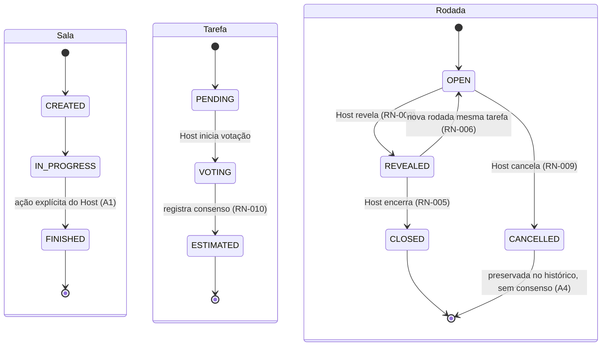
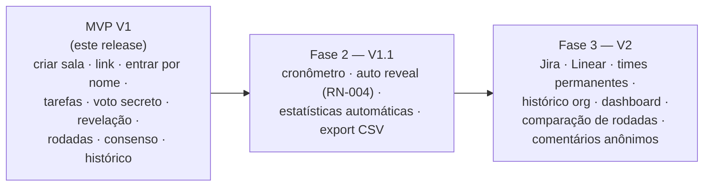
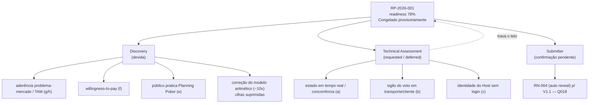

# Readiness Package — PokerPlan

Pacote de prontidão de produto do PokerPlan. Congelado provisoriamente em 2026-06-03, com readiness de 78%. O Technical Assessment ainda está pendente, então o congelamento é provisório: as seções de produto estão fechadas, mas o congelamento definitivo só ocorre quando o Technical Assessment for assinado.

> O Readiness Package é a definição de pronto de produto, o output do PO. Ele se sustenta sozinho: visão, problema, escopo, regras, user stories, NFRs, edge cases, critérios e métricas. O pacote não inclui seções de autoria do CTO; a avaliação técnica vive no Technical Assessment, referenciado no fim deste documento. A camada de confiança vem do Intake vinculado: o que entrou como premissa ou incógnita aparece resolvido ou carregado de forma explícita na seção "Prontidão herdada".

### Painel de prontidão (visão rápida)

| Indicador | Estado |
|---|---|
| Readiness score | 78% (handoff do Intake foi 63%) |
| Estado do portão | Congelado provisoriamente (teto travado pelo TA requisitado/diferido) |
| Seções bloqueantes | 12 resolvidas ou dispostas |
| Technical Assessment | requested / deferred — a skill tech-assessment ainda não existe |
| Itens em aberto | Discovery (aderência de mercado, willingness-to-pay, TAM, correção aritmética); TA devido; RN-004 a confirmar com o Submitter |

> Detalhe dos itens abertos consolidado na seção "Prontidão herdada e itens em aberto" e no Painel de itens abertos ao fim do documento.

## Metadados

| Campo | Valor |
|---|---|
| ID do Pacote | RP-2026-001 |
| Versão | v1 |
| Intake vinculado | INT-2026-001 |
| Responsável | (PO; não nomeado) |
| Escalada ao CTO / Technical Assessment | requisitada, diferida (a skill tech-assessment ainda não existe; ver a seção Referência ao Technical Assessment) |
| Status | Congelado provisoriamente |
| Data de congelamento | 2026-06-03 (provisório) |
| Readiness score | 78% |
| Idioma de saída | pt-BR |
| Nota | O intake de origem foi triado como "Discovery", não como "Product Ready". O PO optou por seguir para o RP com as seções herdadas preenchidas e as seções de Fase 2 ainda pendentes. |
| Nota de freeze | Congelamento provisório: as seções de produto estão congeladas. O congelamento definitivo exige que o Technical Assessment esteja assinado, e ele ainda é devido. |

## Histórico de revisão

| Versão | Data | Autor | Status | Resumo |
|---|---|---|---|---|
| v1 | 2026-06-03 | Doc Updater (engine) | Rascunho | Instanciação a partir do template; seções herdadas preenchidas; seções de autoria do Drafter deixadas como placeholder explícito. |
| v2 | 2026-06-03 | Draft pass | Rascunho | Seções de produto (regras de negócio, user stories, NFRs, edge cases) preenchidas pelo readiness-drafter como rascunho de IA, em confiança parcial. |
| v3 | 2026-06-03 | Escalation flag | Rascunho | O readiness-escalation-flagger detectou gatilhos arquiteturais (runtime/tempo real e segurança/identidade); TechAssessmentRef passou a requisitada/diferida (freeze provisório, porque a skill tech-assessment ainda não existe). |
| v4 | 2026-06-03 | Confirm loop | Rascunho | Decisões do PO aplicadas (Q017 a Q029): escopo Excluído declarado; ambiguidades A1 a A7 resolvidas; Observador entra no V1; status CANCELLED criado; políticas EC-02 e EC-06; alvo de NFR em cerca de 2s p95; números diferidos à Discovery; cifras de economia suprimidas; riscos com probabilidade e impacto firmes. Promoções a po_authored. |
| v5 | 2026-06-03 | Provisional freeze | Congelado provisoriamente | RP congelado provisoriamente (readiness 78%); 12 seções bloqueantes resolvidas ou dispostas; TechAssessmentRef requisitada/diferida mantém o teto em congelamento provisório. |

---

## Prontidão herdada e itens em aberto

> Resumo do que o Intake entregou e do que continua frouxo na entrada da execução. Premissas, incógnitas de Discovery e respostas delegadas que sobreviveram à racionalização precisam ficar visíveis, não enterradas nas seções. Se uma premissa carregada aqui se provar falsa durante a execução, a demanda deve ser reavaliada (vale o mesmo gatilho de retriagem do intake).

| Campo | Valor |
|---|---|
| Readiness Score no handoff do Intake | 63% |
| Itens resolvidos pelo PO (confirm-loop Q017 a Q029) | A1: encerramento da sala disparado pelo Host; A2: consenso livre, sem critério mínimo; A3: desempate é processo humano; A4: status CANCELLED criado; A5: sem limite rígido de participantes; A6: Observador no V1; A7: "todos votaram" diferida a V1.1 com RN-004. Escopo Excluído declarado. EC-02 vira política (Host reassume pelo mesmo link). EC-06 trata nomes duplicados (permitidos e desambiguados). RN-004 confirmado para V1.1 (a confirmação com o Submitter ainda está pendente, Q018). |
| Itens abertos para Discovery | (e) o público já pratica Planning Poker: validar na Discovery; (f) willingness-to-pay não foi testada: Discovery; (g/h) aderência problema-mercado e TAM não validados: Discovery (risco ALTO/ALTO). As cifras de economia ficam suprimidas até a correção do modelo aritmético (cerca de 10x, Discovery item 3). Não há urgência registrada: sem janela, prazo ou competidor, e isso não deve ser inventado. |
| Itens pendentes para o Technical Assessment | (a) sincronização de estado em tempo real para múltiplos participantes simultâneos; (b) sigilo do voto em transporte e no cliente (RN-001); (c) identidade confiável do Host sem login (RN-003/005/009; mecanismo de EC-02; persistência de voto de EC-08). |
| Premissas aceitas (não bloqueantes) | (b) sem autenticação no MVP V1 (premissa do V1); (c) escalas Fibonacci e T-Shirt customizáveis: aceitas; (d) integrações Jira/Linear são V2, confirmado pelo PO. |

### Itens em aberto por destino (resumo)

| Destino | Item | Estado |
|---|---|---|
| Discovery | (e) público já pratica Planning Poker | a validar |
| Discovery | (f) willingness-to-pay | não testada |
| Discovery | (g/h) aderência problema-mercado e TAM | não validados (risco ALTO/ALTO) |
| Discovery | correção do modelo aritmético (cerca de 10x) | cifras suprimidas até corrigir (item 3) |
| Discovery | urgência | nenhuma registrada — não inventar |
| Technical Assessment | (a) estado em tempo real / concorrência | devido |
| Technical Assessment | (b) sigilo do voto em transporte e cliente | devido |
| Technical Assessment | (c) identidade do Host sem login | devido |
| Submitter | RN-004 (auto reveal) confirmado p/ V1.1 | confirmação com o Submitter pendente (Q018) |

---

## Seção 1 — Resumo executivo

O PokerPlan ataca a falta de estrutura e de rastreabilidade no processo de estimativa de tarefas em equipes ágeis. Hoje as sessões de Planning Poker são conduzidas de forma improvisada, com chamadas de vídeo, chats, planilhas e ferramentas gratuitas desconectadas. Isso gera perda de tempo operacional, ausência de histórico das rodadas, votos influenciados pela falta de sigilo real e fragmentação entre ferramentas.

A proposta é uma plataforma digital de Planning Poker que preserva as regras do método físico (votação secreta, revelação controlada pelo host, múltiplas rodadas, consenso registrado) e acrescenta rastreabilidade: histórico consolidado das sessões e das rodadas por tarefa. O MVP V1 cobre o fluxo essencial: criar sala, entrar sem autenticação informando o nome, votar com sigilo, revelar, registrar consenso e consultar histórico.

O resultado de negócio esperado tem duas camadas. A camada A é a eficiência operacional por cliente, com magnitude a quantificar na Discovery (as cifras estão suprimidas até a correção do modelo). A camada B é a oportunidade comercial como produto SaaS para o mercado ágil, e essa camada não foi validada no intake. A aposta comercial é uma premissa de mercado ainda não validada e depende da Discovery (aderência problema-mercado, willingness-to-pay, TAM). O escopo Excluído do MVP V1 foi declarado pelo PO (ver Seção 5).

_Confiança: 75 · Origem: PO · Situação: premissa_
_Fonte: síntese do intake (problema, originador, Objetivo do Produto SRC-002, escopo/MVP V1, impacto da camada B) e confirm-loop Q017 a Q029._
_Nota: a camada comercial (B) não foi validada; não afirmar resultado de negócio firme. Cifras de economia suprimidas até a correção do modelo aritmético (Discovery item 3). Escopo Excluído declarado (Q017)._

---

## Seção 2 — Contexto e problema (a dor, não a solução)

### Cenário atual

As sessões de Planning Poker acontecem de forma improvisada, com ferramentas que não foram feitas para isso: chamadas de vídeo, chats corporativos, planilhas para registrar resultados e soluções gratuitas de Planning Poker desconectadas do restante do processo.

### Limitações

Esses contornos resolvem só a votação pontual, não o fluxo completo. Faltam histórico consolidado das sessões, registro das rodadas por tarefa, justificativas para divergências, exportação de resultados, organização das tarefas estimadas, integração com ferramentas de gestão e visibilidade da evolução das estimativas ao longo do tempo.

### Dor do cliente

Sintomas observáveis:

- Perda de tempo organizando a dinâmica da votação (operação manual em vez de facilitação);
- Falta de registro das estimativas, sem histórico consolidado;
- Dificuldade de acompanhar a evolução do consenso dentro de uma sessão e entre sessões;
- Ausência de histórico para entender por que uma tarefa recebeu certa estimativa, o que faz as equipes repetirem discussões;
- Votos influenciados involuntariamente quando a votação não é de fato secreta;
- Fragmentação entre ferramentas, que gera retrabalho e perda de contexto.

Em resumo: a estimativa, que deveria ser rápida e colaborativa, vira uma atividade operacionalmente desgastante, pouco rastreável e difícil de reproduzir. O problema não é a falta de método, e sim a falta de ferramenta adequada.

### Impacto de negócio

Camada A (eficiência operacional): o processo consome horas recorrentes de estimativa. A magnitude exata por squad ou por sessão carrega uma inconsistência aritmética no modelo do intake (cerca de 10x) e fica diferida à Discovery (item 3). Não usar cifras de economia em materiais até a correção. O problema não é a existência dessas horas, e sim o desperdício causado pela falta de estrutura (ver Prontidão herdada).

_Confiança: 84 · Origem: PO · Situação: respondido_
_Fonte: Submitter direto (Q006 e Q007), intake (problema), confirm-loop Q026/Q029._
_Nota: a dor está descrita com sintomas observáveis e sem prescrever solução, o que atende à rubrica (mínimo 80). Cifras de economia suprimidas até a correção aritmética (Discovery item 3). O PO revisou e confirmou._

---

## Seção 3 — Objetivos e resultado esperado

1. Digitalizar a dinâmica do Planning Poker preservando as regras do método físico (votação secreta, revelação controlada, múltiplas rodadas, consenso registrado).
2. Prover rastreabilidade: histórico consolidado das sessões e registro das rodadas por tarefa, eliminando a repetição de discussões não documentadas.
3. Garantir sigilo real do voto até a revelação, removendo a influência involuntária entre participantes.
4. Reduzir o tempo operacional por sessão (o desperdício causado pela falta de estrutura).

Os valores-alvo mensuráveis ficam diferidos à Discovery (Q026). O objetivo 4 (tempo operacional) depende da correção do modelo de eficiência antes de receber um alvo numérico.

_Confiança: 65 · Origem: PO · Situação: discovery_
_Fonte: SRC-002 §Objetivo do Produto; intake (impacto, problema); confirm-loop Q026._
_Nota: objetivos qualitativos confirmados pelo PO; valores-alvo mensuráveis diferidos à Discovery; não usar cifras até a correção aritmética._

---

## Seção 4 — Personas impactadas e jobs-to-be-done

A demanda tem duas camadas: personas internas (usuários diretos) e segmentos de mercado comercial (compradores do SaaS).

Personas internas (job a realizar e como são impactadas):

- Desenvolvedores: votam; querem votar sem influência e ter histórico.
- Product Owners: conduzem ou participam; querem rastreabilidade para priorizar.
- Scrum Masters e facilitadores: gerenciam a dinâmica; querem facilitar sem operação manual fragmentada.
- Tech Leads: conduzem votações técnicas; querem histórico para justificar estimativas.
- Gestores de produto, engenharia e gestão: dependem das estimativas; querem visibilidade da evolução.

Segmentos de mercado comercial (alvo SaaS): empresas de tecnologia, consultorias de software, fábricas de software, times product-led e organizações Scrum/ágil.

Observação: o papel Observador (o Host promove um participante a Observador) entra no V1 (A6 resolvida, Q021). Gestores e stakeholders que queiram acompanhar sem votar usam esse papel.

### Mapa de personas / jobs-to-be-done

| Persona | Job-to-be-done | Como é impactada |
|---|---|---|
| Desenvolvedor | Votar sem influência e consultar histórico | Vota com sigilo (RN-001); deixa de ser influenciado por votação aberta |
| Product Owner | Priorizar com base em estimativas | Ganha rastreabilidade das rodadas para priorizar |
| Scrum Master / Facilitador (Host) | Conduzir a dinâmica | Facilita sem operação manual fragmentada; controla revelação/encerramento/cancelamento |
| Tech Lead | Justificar votações técnicas | Usa o histórico para justificar estimativas e evitar repetir discussões |
| Gestor (produto, engenharia, gestão) | Acompanhar a evolução das estimativas | Ganha visibilidade da evolução; pode acompanhar como Observador |
| Observador (V1) | Acompanhar sem votar | O Host o promove; vê só a contagem no OPEN e os valores na revelação; fora de "todos votaram" (RN-OBS, A6) |

Segmentos de mercado comercial (alvo SaaS), sem dimensionamento de TAM (item de Discovery):

| Segmento | Observação |
|---|---|
| Empresas de tecnologia | alvo SaaS |
| Consultorias de software | alvo SaaS |
| Fábricas de software | alvo SaaS |
| Times product-led | alvo SaaS |
| Organizações Scrum/ágil | alvo SaaS |

_Confiança: 78 · Origem: PO · Situação: respondido_
_Fonte: Submitter direto (Q008 personas; Q010 segmentos), intake (reach), confirm-loop Q021._
_Nota: personas e segmentos claros (atende ao mínimo 70); Observador confirmado no V1 pelo PO. Sem dimensionamento de TAM, que é item de Discovery; não inventar números de mercado._

---

## Seção 5 — Escopo incluído e excluído

### Incluído

MVP V1: criar sala; compartilhar link; entrar sem autenticação (só nome); cadastro de tarefas; votação secreta; revelação de votos (controle do host); múltiplas rodadas; definição de consenso; histórico da sessão; papel Observador (o Host promove um participante a Observador).

### Excluído

Fora do MVP V1:

- Autenticação e gestão de identidade de usuário.
- Contas e tenancy organizacional (org-level).
- Todas as funcionalidades de V1.1: cronômetro; auto reveal (RN-004); estatísticas automáticas; exportação CSV.
- Todas as funcionalidades de V2: integração Jira/Linear; times permanentes; histórico organizacional; dashboard de métricas; comparação entre rodadas; comentários anônimos por voto.

### Adiado (fases futuras)

V1.1: cronômetro, auto reveal (RN-004), estatísticas automáticas, exportação CSV.

V2: integração Jira e Linear, times permanentes, histórico organizacional, dashboard de métricas, comparação entre rodadas, comentários anônimos por voto.

### Escopo lado a lado

| V1 — Incluído (este release) | V1.1 — Adiado | V2 — Adiado | Excluído do V1 |
|---|---|---|---|
| Criar sala | Cronômetro | Integração Jira | Autenticação e gestão de identidade |
| Compartilhar link | Auto reveal (RN-004) | Integração Linear | Contas e tenancy organizacional (org-level) |
| Entrar sem autenticação (só nome) | Estatísticas automáticas | Times permanentes | (Todo V1.1 e V2 está fora do V1) |
| Cadastro de tarefas | Exportação CSV | Histórico organizacional | |
| Votação secreta | | Dashboard de métricas | |
| Revelação de votos (controle do Host) | | Comparação entre rodadas | |
| Múltiplas rodadas | | Comentários anônimos por voto | |
| Definição de consenso | | | |
| Histórico da sessão | | | |
| Papel Observador (Host promove) | | | |

_Confiança: 90 · Origem: PO · Situação: decidido_
_Fonte: SRC-002 §Funcionalidades do MVP (V1/V1.1/V2); intake (prioridade), constraints, confirm-loop Q017/Q021._
_Nota: o Excluído foi declarado explicitamente pelo PO (Q017), o que satisfaz a rubrica. O Observador está dentro do V1 (A6 resolvida, Q021). Autenticação e org-level confirmados fora do V1._

---

## Seção 6 — Regras de negócio e fluxos

### Regras de negócio do Planning Poker (RN-001 a RN-010, mais RN-004)

Regras restabelecidas a partir da especificação (SRC-002 §Regras de Negócio). Marcação: V1 é o MVP V1; V1.1 é a fase seguinte.

| ID | Regra (produto) | Versão | Observação |
|----|-----------------|--------|------------|
| RN-001 | Os votos permanecem secretos até a revelação. Durante a rodada aberta, o sistema mostra apenas a contagem de votos (por exemplo, "5 de 7 votaram"), nunca os valores. | V1 | Regra central. |
| RN-002 | Um participante pode alterar seu voto enquanto a rodada estiver OPEN. | V1 | Complementa RN-008. |
| RN-003 | Somente o Host pode revelar os votos (OPEN → REVEALED). | V1 | Controle do Host. |
| RN-004 | A sala pode opcionalmente usar Auto Reveal: a revelação dispara sozinha quando todos os habilitados a votar tiverem votado, sem ação do Host. | V1.1 | Confirmado para V1.1 pelo PO; confirmação com o Submitter pendente (Q018). |
| RN-005 | Somente o Host pode encerrar uma rodada (REVEALED → CLOSED). | V1 | Controle do Host. |
| RN-006 | Uma tarefa pode ter múltiplas rodadas; o Host pode abrir nova rodada para a mesma tarefa. | V1 | Re-votação. |
| RN-007 | O histórico de todas as rodadas (votos, valores revelados, consenso) é armazenado e consultável. | V1 | Rastreabilidade. |
| RN-008 | Participantes que entrarem após o encerramento da rodada não podem votar retroativamente. | V1 | Sem voto retroativo. |
| RN-009 | O Host pode cancelar uma rodada. | V1 | Ver A4 sobre o estado resultante. |
| RN-010 | A estimativa final (consenso) é registrada separadamente dos votos; não precisa ser a média. | V1 | O Host decide o consenso livremente; sem critério mínimo de sistema (A2 resolvida, Q019). |
| RN-OBS | O Host pode promover um participante a Observador. O Observador vê apenas a contagem durante a rodada OPEN (RN-001) e os valores na revelação; fica de fora da contagem de "todos votaram". | V1 | A6 resolvida, Q021; relevante para RN-004 em V1.1. |

### Fluxo de transição de estado

- Sala: CREATED → IN_PROGRESS → FINISHED. A sala vai a FINISHED por ação explícita do Host (A1 resolvida).
- Tarefa: PENDING → VOTING → ESTIMATED (recebe a estimativa_final ao registrar o consenso, RN-010).
- Rodada: OPEN → REVEALED → CLOSED (caminho feliz). De OPEN, o cancelamento (RN-009) leva a CANCELLED, preservada no histórico sem consenso (A4 resolvida, Q020). Em REVEALED, o Host registra o consenso (RN-010) ao encerrar ou abre nova rodada (RN-006).

Enum de status de Rodada: {OPEN, REVEALED, CLOSED, CANCELLED}

- CANCELLED: rodada cancelada pelo Host (RN-009); preservada no histórico (RN-007) sem consenso (A4 resolvida, Q020).

RN-OBS (V1): o Host pode promover um participante a Observador. O Observador vê apenas a contagem durante a rodada OPEN (RN-001) e os valores na revelação; fica de fora da contagem de "todos votaram" (o que importa para o RN-004 em V1.1). A6 resolvida, Q021.

#### Decisões (A1 a A7)

- A1: a sala vai a FINISHED por ação explícita do Host (resolvida).
- A2: o Host decide o consenso livremente, sem critério mínimo de sistema (RN-010 confirmado; resolvida, Q019).
- A3: o desempate é processo humano de discussão ("ouvir o menor e o maior voto"), não regra de sistema (resolvida).
- A4: status CANCELLED criado; rodada cancelada é preservada no histórico sem consenso (resolvida, Q020).
- A5: sem limite rígido de participantes no V1 (cerca de 8 é referência de produto, não constraint de sistema; resolvida).
- A6: Observador incluído no V1, com o Host promovendo um participante a Observador (resolvida, Q021).
- A7: a definição de "todos votaram" foi diferida com o RN-004 para V1.1 (resolvida para V1; pendente para V1.1).

_Confiança: 88 · Origem: PO · Situação: decidido_
_Fonte: SRC-002 §Regras de Negócio; confirm-loop Q018/Q019/Q020/Q021._
_Nota: ambiguidades A1 a A7 resolvidas pelo PO; RN-004 confirmado para V1.1 (confirmação com o Submitter pendente, Q018); enum de rodada atualizado para incluir CANCELLED; RN-OBS adicionado para o V1._

---

## Seção 7 — User stories e critérios de aceite

User stories do fluxo MVP V1. Personas: Desenvolvedor, Product Owner, Scrum Master/Facilitador (Host), Tech Lead, Gestor.

### User stories em resumo

| ID | Persona | Objetivo | AC resumida |
|---|---|---|---|
| ST-001 | Facilitador | Criar sala e receber link compartilhável | Sala criada em CREATED com link; abrir o link acessa a mesma sala |
| ST-002 | Desenvolvedor | Entrar só com o nome (sem autenticação) | Admitido como Participante, vê tarefa e estado da rodada; nenhuma senha exigida (premissa b) |
| ST-003 | Host | Cadastrar tarefas a estimar | Tarefa entra como PENDING; ao iniciar votação vai a VOTING e é apresentada |
| ST-004 | Desenvolvedor | Votar com sigilo | Voto registrado sem que outros vejam o valor; só a contagem aparece (RN-001) |
| ST-005 | Desenvolvedor | Alterar voto com a rodada aberta | Voto atualizado em OPEN (RN-002); bloqueado em REVEALED/CLOSED (RN-002/008) |
| ST-006 | Host | Revelar os votos quando pronto | OPEN → REVEALED e votos exibidos (RN-003); não-Host não tem a ação |
| ST-007 | Host | Abrir nova rodada para re-votar | Nova rodada OPEN na mesma tarefa; votos anteriores no histórico (RN-006/007) |
| ST-008 | Host | Registrar o consenso | Estimativa final livre (sem critério mínimo, A2); gravada à parte (RN-010); tarefa vai a ESTIMATED |
| ST-009 | Tech Lead | Consultar histórico da sessão | Vê por tarefa as rodadas, votos revelados e consenso (RN-007); rodadas em ordem |
| ST-010 | PO / Gestor | Ver estimativas consolidadas | Vê estimativa_final por tarefa via histórico (RN-007/ST-009); dashboard dedicado é V2 |
| ST-011 | Gestor / Stakeholder | Acompanhar como Observador | Promovido pelo Host; vê só contagem no OPEN, valores na revelação; fora de "todos votaram" (RN-OBS, A6) |

ST-001 — Criar sala e compartilhar link. Como Facilitador, quero criar uma sala e receber um link compartilhável, para reunir o time sem configuração prévia.
- Given um Facilitador na tela inicial, when ele cria uma sala, then a sala é criada com status CREATED e um link compartilhável é exibido.
- Given uma sala recém-criada, when o Facilitador abre o link, then a mesma sala é acessada.

ST-002 — Entrar na sala por nome (sem autenticação). Como Desenvolvedor, quero entrar informando apenas meu nome, para participar sem criar conta.
- Given um link válido, when o participante informa um nome e entra, then é admitido como Participante e vê a tarefa atual e o estado da rodada.
- Given uma sessão em andamento, when alguém entra por nome, then nenhuma autenticação ou senha é exigida (premissa b).

ST-003 — Cadastrar tarefas. Como Host, quero cadastrar as tarefas a estimar, para conduzir a sessão tarefa a tarefa.
- Given um Host numa sala, when adiciona uma tarefa, then ela aparece com status PENDING.
- Given uma lista de tarefas, when o Host inicia a votação de uma, then a tarefa vai a VOTING e é apresentada a todos.

ST-004 — Votar com sigilo. Como Desenvolvedor, quero escolher minha carta sem que os outros vejam, para estimar sem influência.
- Given uma rodada OPEN, when o participante seleciona uma carta da escala, then o voto é registrado e os demais não veem o valor (RN-001).
- Given rodada OPEN com votos parciais, when alguém olha o progresso, then vê apenas a contagem, nunca os valores (RN-001).

ST-005 — Alterar o voto com a rodada aberta. Como Desenvolvedor, quero mudar meu voto enquanto a rodada estiver aberta.
- Given rodada OPEN e voto registrado, when o participante escolhe outra carta, then o voto é atualizado (RN-002).
- Given rodada REVEALED ou CLOSED, when tenta alterar, then é bloqueado (RN-002/RN-008).

ST-006 — Revelar os votos (Host). Como Host, quero revelar quando estiver pronto, para abrir a discussão.
- Given rodada OPEN, when o Host aciona Revelar, then a rodada vai a REVEALED e todos os votos são exibidos (RN-003).
- Given rodada OPEN, when um não-Host procura revelar, then a ação não está disponível (RN-003).

ST-007 — Nova rodada após discussão. Como Host, quero abrir nova rodada para a mesma tarefa, para re-votar.
- Given tarefa com rodada REVEALED ou CLOSED, when o Host inicia nova rodada, then uma nova rodada OPEN é criada para a mesma tarefa e os votos anteriores ficam no histórico (RN-006/RN-007).

ST-008 — Registrar o consenso. Como Host, quero registrar a estimativa final, para fechar a tarefa.
- Given rodada REVEALED, when o Host registra a estimativa final, then ele a registra livremente (sem critério mínimo de sistema, A2 resolvida, Q019); o consenso é gravado separadamente dos votos (RN-010) e a tarefa vai a ESTIMATED.
- Given divergência, when registra o consenso, then o valor não precisa ser a média (RN-010).

ST-009 — Consultar histórico da sessão. Como Tech Lead, quero consultar o histórico de rodadas e estimativas, para justificar estimativas e evitar repetir discussões.
- Given sessão com tarefas estimadas, when abre o histórico, then vê por tarefa as rodadas, os votos revelados e o consenso (RN-007).
- Given tarefa com múltiplas rodadas, when a inspeciona, then vê cada rodada na ordem em que ocorreu.

ST-010 — Visibilidade para Gestor/PO. Como PO ou Gestor, quero ver as estimativas consolidadas, para priorizar e planejar.
- Given sessão com tarefas ESTIMATED, when o PO consulta a sessão, then vê a estimativa_final de cada tarefa. No V1, as estimativas consolidadas são visíveis pelo histórico da sessão (RN-007/ST-009); um dashboard de gestão dedicado é V2 (fora do escopo V1).

ST-011 — Acompanhar como Observador. Como Gestor ou Stakeholder, quero acompanhar a sessão sem votar, para observar sem influenciar.
- Given um participante na sala, when o Host o promove a Observador, then ele passa a Observador; durante a rodada OPEN vê apenas a contagem (RN-001), na revelação vê os valores, e não é contado em "todos votaram" (RN-OBS / A6 resolvida, Q021).

_Confiança: 86 · Origem: PO · Situação: decidido_
_Fonte: SRC-002 §MVP V1; RN-001 a RN-010; confirm-loop Q019/Q020/Q021._
_Nota: ST-001 a ST-011 cobrem o fluxo V1; ST-008 firmado (A2 resolvida); ST-010 clarificado (dashboard é V2); ST-011 adicionado para o papel Observador (A6 resolvida); o Auto Reveal (RN-004) ficou deliberadamente sem story (é V1.1)._

---

## Seção 8 — Requisitos não-funcionais (NFRs)

NFRs no scaffold ISO/IEC 25010, com apenas as dimensões que a demanda plausivelmente precisa. Os valores-alvo são requisitos de qualidade do PO, não afirmações de viabilidade. A viabilidade, sobretudo do estado em tempo real para participantes simultâneos (premissa a), pertence ao Technical Assessment.

- Performance efficiency (sincronização de estado): ao revelar (RN-003) ou registrar voto, a mudança reflete para todos os conectados em até cerca de 2s p95 (alvo de produto definido pelo PO, Q025); a contagem de progresso atualiza em tempo quase real. A viabilidade vai para o Technical Assessment.
- Reliability (consistência da rodada): o estado (OPEN/REVEALED/CLOSED/CANCELLED) e os votos não se perdem por falha intermitente; ao reconectar, o participante vê o estado correto, sem voto fantasma ou duplicado. Disponibilidade-alvo na sessão: a definir (refinamento não bloqueante).
- Security / Confidentiality (sigilo do voto, RN-001): os valores não podem ser obtidos por nenhum participante antes da revelação, nem por inspeção do cliente ou da rede; durante OPEN só trafega a contagem. O como vai para o Technical Assessment.
- Security / Access control (controle do Host, RN-003/005/009): revelar, encerrar e cancelar só pelo Host. Política de produto: o Host original reassume os direitos de Host pelo mesmo link na reconexão (EC-02/Q023); o mecanismo de vínculo de identidade sem login é questão do Technical Assessment.
- Usability (entrada sem fricção): o novo participante fica pronto para votar fornecendo só um nome, sem cadastro. Alvo: a definir (refinamento não bloqueante).
- Compatibility (acesso por navegador): os participantes entram pelo link em navegador, possivelmente em dispositivos diferentes. Navegadores e dispositivos suportados: a definir (refinamento não bloqueante).

### NFRs em resumo (ISO/IEC 25010)

| Dimensão | Alvo de produto (PO) | Destino da viabilidade |
|---|---|---|
| Performance efficiency (sync de estado) | reflete a todos em ~2s p95 (Q025) | Technical Assessment |
| Reliability (consistência da rodada) | sem perda de estado/voto; reconexão correta; disponibilidade a definir | TA (parte) / refinamento não bloqueante |
| Security / Confidentiality (RN-001) | valores nunca antes da revelação; só contagem em OPEN | "como" no Technical Assessment |
| Security / Access control (RN-003/005/009) | host-only; Host reassume pelo mesmo link (EC-02/Q023) | mecanismo de identidade no TA |
| Usability (entrada sem fricção) | pronto p/ votar só com o nome; alvo a definir | refinamento não bloqueante |
| Compatibility (navegador) | acesso por link em navegador; suportados a definir | refinamento não bloqueante |

Dimensões não propostas por falta de base: Maintainability e Portability (vão para o Technical Assessment, se relevantes). A Functional suitability é coberta pelas Regras de Negócio.

_Confiança: 72 · Origem: PO · Situação: decidido_
_Fonte: SRC-002 §NFRs; confirm-loop Q023/Q025._
_Nota: alvo de latência de cerca de 2s p95 firmado pelo PO (Q025); política de identidade do Host firmada (EC-02/Q023); os itens "a definir" são refinamentos não bloqueantes; viabilidade e mecanismos vão para o Technical Assessment._

---

## Seção 9 — Edge cases e modos de falha

Edge cases ancorados nas RNs e no fluxo V1. Cada item traz o cenário e o comportamento esperado; [DISCOVERY] marca onde a spec não dá base.

- EC-01 Participante sai no meio da rodada (OPEN): no V1 a contagem "X de Y" é informativa; o denominador conta os participantes que estão na sala no momento. O voto de quem reconecta persiste (EC-08). O gatilho "todos votaram" só importa para o Auto Reveal (RN-004), diferido a V1.1 (A7 resolvida).
- EC-02 Host desconecta ou sai: por política de produto, o Host original reassume os direitos de Host pelo mesmo link ao reconectar (Q023). O mecanismo de identidade-sem-login para implementar essa política vai para o Technical Assessment.
- EC-03 Reveal com votos parciais (RN-003): a rodada vai a REVEALED exibindo os votos existentes e marcando os ausentes como "não votou". A representação de "não votou" é detalhe de UI (não bloqueante para o release V1).
- EC-04 Rodada com zero votos: a revelação não produz consenso automático; o Host pode cancelar (RN-009, gerando o status CANCELLED) ou registrar consenso manual (RN-010). Revelar com zero votos é permitido (controle do Host, RN-003).
- EC-05 Late joiner após o encerramento (RN-008): não pode votar retroativamente; pode participar da próxima rodada (RN-006).
- EC-06 Nomes duplicados na entrada: nomes duplicados são permitidos; o sistema desambigua internamente (id de sessão único por participante; sufixo ou avatar opcional na UI), preservando a atribuição correta do voto (Q024).
- EC-07 Rodada cancelada (RN-009): cancelar uma rodada (RN-009) a leva ao status CANCELLED, preservada no histórico sem consenso (A4 resolvida, Q020).
- EC-08 Refresh ou reconexão do navegador: ao reconectar, ver o estado atual; o voto em rodada OPEN persiste, sem perder nem duplicar. O como (persistência sem login) vai para o Technical Assessment.
- EC-09 Ação restrita executada por não-Host (RN-003/005/009): negada ou indisponível; só o Host executa.
- EC-10 Alterar voto fora da rodada aberta (RN-002/008): bloqueado.
- EC-11 Votos simultâneos e concorrência: a contagem converge para o total correto sem perder votos. A garantia de concorrência vai para o Technical Assessment.

### Edge cases por disposição

| EC | Resolvido por produto (PO) | Componente técnico no TA |
|---|---|---|
| EC-01 contagem informativa | sim (A7) | — |
| EC-02 sucessão de Host | política (Q023) | mecanismo de identidade-sem-login |
| EC-03 reveal parcial | sim (UI não bloqueante) | — |
| EC-04 zero votos | sim (RN-009/010) | — |
| EC-05 late joiner | sim (RN-008/006) | — |
| EC-06 nomes duplicados | sim (Q024) | — |
| EC-07 rodada cancelada | sim (A4/Q020) | — |
| EC-08 reconexão | comportamento definido | persistência sem login no TA |
| EC-09 ação host-only por não-Host | sim (por RN) | — |
| EC-10 alterar voto fora de OPEN | sim (por RN) | — |
| EC-11 concorrência | comportamento definido | garantia de concorrência no TA |

Observação: não há feature de IA neste escopo.

_Confiança: 78 · Origem: PO · Situação: decidido_
_Fonte: SRC-002; RN-001 a RN-OBS; confirm-loop Q020/Q021/Q023/Q024._
_Nota: EC-01, EC-02, EC-06 e EC-07 foram resolvidos por decisão de produto do PO; EC-02, EC-08 e EC-11 ainda têm componente técnico roteado ao Technical Assessment; EC-09 e EC-10 estão firmes por RN._

---

## Seção 10 — Métricas de sucesso (primária · secundária · guardrail)

Métricas-proxy. Os alvos ficam diferidos à Discovery (o PO confirmou a disposição):

- Leading (eficiência): redução do tempo operacional por sessão. Alvo diferido à Discovery (cifra suprimida até a correção do modelo, Q026/Q029).
- Leading (rastreabilidade): percentual de rodadas com histórico armazenado e consultável (qualitativo e contável, não depende do modelo aritmético).
- Lagging (qualidade): melhoria da previsibilidade e da qualidade das estimativas, via decisões registradas e divergências rastreáveis.
- Guardrail: nenhum guardrail firmado, diferido à Discovery.

### Métricas em resumo

| Tipo | Métrica | Alvo |
|---|---|---|
| Leading (eficiência) | Redução do tempo operacional por sessão | diferido à Discovery (cifra suprimida até correção, Q026/Q029) |
| Leading (rastreabilidade) | % de rodadas com histórico armazenado e consultável | contável; não depende do modelo aritmético |
| Lagging (qualidade) | Previsibilidade e qualidade das estimativas | via decisões registradas e divergências rastreáveis |
| Guardrail | (nenhum) | nenhum firmado — diferido à Discovery |

_Confiança: 50 · Origem: PO · Situação: discovery_
_Fonte: intake (impacto, proxies); Discovery brief item 3; confirm-loop Q026/Q029._
_Nota: cifra de economia suprimida (inconsistência aritmética de cerca de 10x ainda não corrigida); alvos diferidos à Discovery pelo PO (Q026); o percentual de rodadas com histórico é métrica contável e não depende do modelo; nenhum guardrail firmado._

---

## Seção 11 — Critérios de sucesso e aceite (do release)

Negócio: o fluxo essencial de uma sessão de estimativa é executável de ponta a ponta (criar sala, entrar por nome, votar com sigilo, revelar, consenso, histórico) sem ferramentas externas.

Qualidade: as RNs centrais são respeitadas e verificáveis: sigilo até a revelação (RN-001), voto alterável só com a rodada aberta (RN-002), revelação, encerramento e cancelamento só pelo host (RN-003/005/009), múltiplas rodadas (RN-006), histórico completo (RN-007), sem voto retroativo (RN-008) e consenso registrado separado dos votos (RN-010).

UX: a entrada sem autenticação (só nome) funciona; o progresso mostra apenas a contagem de votos, nunca os valores antes da revelação.

Os critérios são verificáveis como pass/fail. O RN-004 (auto reveal) não é critério do release V1 (é V1.1). Aceito pelo PO (Q027).

_Confiança: 80 · Origem: PO · Situação: decidido_
_Fonte: SRC-002 §MVP V1; constraints RN-001 a RN-010; Discovery brief §critério de saída; confirm-loop Q027._
_Nota: critérios pass/fail confirmados pelo PO; RN-004 explicitamente excluído do release V1; dimensões Negócio, Qualidade e UX cobertas._

---

## Seção 12 — Riscos e dependências (de produto e negócio)

Riscos de produto e de negócio (riscos técnicos migram para o Technical Assessment):

- Aderência problema-mercado não validada (premissas g/h). Probabilidade: ALTA. Impacto: ALTO. Mitigação: Discovery (5 a 10 entrevistas com segmentos-alvo). [discovery]
- Willingness-to-pay desconhecida e monetização não testada (premissa f). Probabilidade: MÉDIA. Impacto: ALTO. Mitigação: teste de conceito ou landing, com perguntas de preço. [discovery]
- Inconsistência aritmética no modelo de eficiência (cerca de 10x). Probabilidade: CONFIRMADA (já ocorreu). Impacto: MÉDIO (credibilidade). Mitigação: suprimir cifras até corrigir (Discovery item 3). [discovery]
- Urgência ausente. Probabilidade: N/A. Impacto: BAIXO a MÉDIO (enfraquece a priorização). Mitigação: reavaliar via Discovery item 5.
- O público pode não praticar Planning Poker (premissa e). Probabilidade: BAIXA a MÉDIA. Impacto: MÉDIO (posicionamento e onboarding). Mitigação: validar nas entrevistas. [premissa]

### Riscos em matriz (probabilidade x impacto)

| Risco | Probabilidade | Impacto | Mitigação | Tag |
|---|---|---|---|---|
| Aderência problema-mercado (g/h) | ALTA | ALTO | Discovery (5 a 10 entrevistas) | discovery |
| Willingness-to-pay / monetização (f) | MÉDIA | ALTO | Teste de conceito/landing com preço | discovery |
| Inconsistência aritmética (~10x) | CONFIRMADA | MÉDIO | Suprimir cifras até corrigir (item 3) | discovery |
| Urgência ausente | N/A | BAIXO a MÉDIO | Reavaliar via Discovery item 5 | — |
| Público pode não praticar Planning Poker (e) | BAIXA a MÉDIA | MÉDIO | Validar nas entrevistas | premissa |

Dependências de produto e negócio: Jira e Linear são V2; o MVP V1 não depende delas.

_Confiança: 78 · Origem: PO · Situação: decidido_
_Fonte: intake (impacto, hint; assumptions f/g/h; urgência; triage); confirm-loop Q028._
_Nota: probabilidade e impacto firmados pelo PO; os itens comerciais (g/h/f) serão validados na Discovery; na inconsistência aritmética, as cifras ficam suprimidas até a correção; Jira/Linear confirmadas como V2._

---

## Seção 13 — Avaliação preliminar de esforço e custo

Avaliação preliminar, de uso interno e para sequenciamento, não um compromisso. O MVP V1 é uma extensão de UI e estado com regras bem definidas (RN-001 a RN-010), sem pagamentos, sem multi-tenancy complexo, sem IA ou runtime e sem integrações externas (que são V2). A entrada sem autenticação reduz a superfície. O ponto de esforço e risco técnico ainda em aberto é o estado em tempo real para múltiplos participantes simultâneos (premissa a), cuja viabilidade cabe ao Tech Lead racionalizar.

_Confiança: 30 · Origem: herdada · Situação: diferido_
_Fonte: SRC-002 §MVP V1; intake (cto_escalation)._
_Nota: não bloqueante; o número firme vem do Technical Assessment do CTO; a premissa de tempo real (a) pode mover a estimativa._

---

## Seção 14 — Roadmap sugerido

### MVP (este release)

Criar sala, compartilhar link, entrar sem autenticação, cadastro de tarefas, votação secreta, revelação, múltiplas rodadas, definição de consenso e histórico da sessão.

### Fase 2 (backlog futuro)

V1.1: cronômetro, auto reveal (RN-004), estatísticas automáticas, exportação CSV.

### Fase 3 (backlog futuro)

V2: integração Jira, integração Linear, times permanentes, histórico organizacional, dashboard de métricas, comparação entre rodadas, comentários anônimos por voto.

_Confiança: 65 · Origem: herdada · Situação: premissa_
_Fonte: SRC-002 §Funcionalidades do MVP; intake (prioridade)._
_Nota: não bloqueante; o escalonamento V1 > V1.1 > V2 é priorização de escopo, não prioridade de portfólio; confirmar o escopo de V2 (premissa d)._

---

## Referência ao Technical Assessment

> **Caixa de destaque — Technical Assessment**
> - **Status:** requested · **Disposition:** deferred · **Veredito:** pendente
> - **Gatilhos arquiteturais:** (1) runtime/estado em tempo real; (2) segurança/identidade (sigilo do voto em transporte; identidade do Host sem login).
> - **Efeito no portão:** congelamento provisório das seções de produto. O congelamento definitivo exige TA = signed; a skill tech-assessment ainda não existe (link indisponível).
> - **Não são gatilhos no V1:** multi-tenancy/org-level (V2) e integrações Jira/Linear (V2).

Esta seção é a ponte para o artefato do CTO: status, veredito e link, não o conteúdo.

TechAssessmentRef
- status: requested
- veredito: pendente (preenchido quando o status passar a signed)
- disposition: deferred
- link: indisponível (a skill tech-assessment ainda não existe)

Decisão: a escalada ao CTO foi requisitada. O MVP V1, embora modesto em escopo de produto, carrega incógnitas de viabilidade técnica que pertencem ao Technical Assessment, não à decisão de produto do PO. Isso corrige o rascunho do intake ("Needed: No"), que subdimensionou as questões de tempo real, sigilo em transporte e identidade-sem-login, tratando-as como racionalização de Tech Lead em vez de gatilhos do CTO.

Gatilhos arquiteturais disparados:
1. Runtime e estado em tempo real (premissa a): sincronização de estado entre participantes simultâneos, com alvo de latência (cerca de 2s p95), consistência de rodada (OPEN/REVEALED/CLOSED) e reconexão sem voto fantasma ou duplicado (NFR Performance/Reliability; EC-08; EC-11). É o maior risco técnico em aberto do MVP.
2. Segurança, autenticação e autorização: (a) sigilo do voto em transporte (RN-001), pois os valores não podem vazar por inspeção do cliente ou da rede antes da revelação; (b) identidade confiável do Host sem login (premissa b), pois as ações host-only (revelar, encerrar, cancelar, RN-003/005/009) e a sucessão de Host em desconexão (EC-02) dependem de um vínculo de identidade que o V1 não autentica.

Não são gatilhos no V1: multi-tenancy e isolamento de dados (org-level é V2) e integrações externas Jira/Linear (V2).

O Technical Assessment deve emitir veredito sobre, no mínimo: (i) a viabilidade da sincronização de estado em tempo real para participantes simultâneos e o modelo de concorrência; (ii) como garantir o sigilo do voto em transporte e no cliente (RN-001); (iii) como vincular a identidade do Host de forma confiável sem autenticação (RN-003/005/009 e EC-02), incluindo o mecanismo que permite ao Host original reassumir os direitos pelo mesmo link na reconexão (a política foi decidida pelo PO em Q023; o como técnico é responsabilidade do TA).

Distinção entre produto e técnica: o que conta como consenso (A2), os nomes duplicados (EC-06) e o papel Observador (A6) são decisões de produto do PO; tempo real, sigilo em transporte e identidade-sem-login são viabilidade técnica do CTO.

Freeze provisório: a skill tech-assessment ainda não existe, então o TA fica deferred ("TA needed; tech-assessment skill not yet available") e o RP congela provisoriamente. As seções de produto ficam congeladas, com o manifesto registrando tech-assessment-ref: deferred (TA pendente, fora do escopo atual da ferramenta). Quando a skill tech-assessment existir, o portão será apertado para exigir status = signed antes do congelamento definitivo.

_Confiança: computada · Origem: rascunho de IA · Status: requested · Situação: deferred_
_Fonte: readiness-escalation-flagger; entradas: scope, business-rules, nfrs, risks._
_Nota: o TA foi disparado por gatilhos arquiteturais (runtime/tempo real e segurança/identidade); como a skill tech-assessment não existe, fica deferred; o RP fica em congelamento provisório até o TA estar signed._

---

## Estado das seções (resumo de proveniência)

| Seção | Confiança | Origem | Situação |
|---|---|---|---|
| 1 — Resumo executivo | 75 | PO | premissa |
| 2 — Contexto e problema | 84 | PO | respondido |
| 3 — Objetivos | 65 | PO | discovery |
| 4 — Personas | 78 | PO | respondido |
| 5 — Escopo | 90 | PO | decidido |
| 6 — Regras de negócio | 88 | PO | decidido |
| 7 — User stories | 86 | PO | decidido |
| 8 — NFRs | 72 | PO | decidido |
| 9 — Edge cases | 78 | PO | decidido |
| 10 — Métricas | 50 | PO | discovery |
| 11 — Critérios de aceite | 80 | PO | decidido |
| 12 — Riscos | 78 | PO | decidido |
| 13 — Esforço e custo | 30 | herdada | diferido |
| 14 — Roadmap | 65 | herdada | premissa |
| Technical Assessment | computada | rascunho de IA | deferred |

---

## Painel de itens abertos (visão de fechamento)

| Item em aberto | Dono | Estado | Bloqueia o quê |
|---|---|---|---|
| Aderência problema-mercado e TAM (g/h) | Discovery | não validado (risco ALTO/ALTO) | aposta comercial (camada B) |
| Willingness-to-pay (f) | Discovery | não testada | monetização |
| Público pratica Planning Poker (e) | Discovery | a validar | posicionamento/onboarding |
| Correção do modelo aritmético (~10x) | Discovery item 3 | cifras suprimidas até corrigir | uso de cifras de economia |
| Technical Assessment | CTO / skill futura | requested / deferred | congelamento definitivo (teto travado) |
| RN-004 (auto reveal) p/ V1.1 | Submitter | confirmação pendente (Q018) | escopo de V1.1 |

> Nota de integridade: as cifras de economia permanecem suprimidas em todo o documento até a correção do modelo aritmético (Discovery item 3). Nenhum guardrail foi firmado. Não há urgência registrada e ela não deve ser inventada.

<!-- END OF DOCUMENT -->
