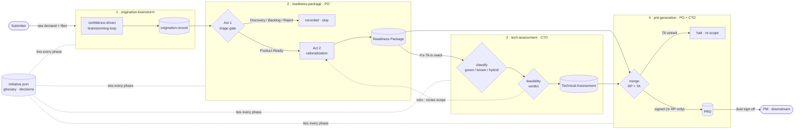

# Teamwork Process Marketplace

> The **`hsb-tech`** Claude Code plugin marketplace — and the development home of
> **`hsb-teamwork`**, a demand-to-delivery toolkit for Claude Code and Codex.

|                 |                                             |
|-----------------|---------------------------------------------|
| **Marketplace** | `hsb-tech`                                  |
| **Plugin**      | `hsb-teamwork` (v0.4.0)                     |
| **Author**      | Hugo Seabra                                 |
| **Repo**        | `hugo-hsbtech/teamwork-process-marketplace` |

This repository is two things at once:

1. **A plugin marketplace.** Its root holds [`.claude-plugin/marketplace.json`](.claude-plugin/marketplace.json),
   so anyone can add it to Claude Code and install the plugins it lists.
2. **The development home of the `hsb-teamwork` plugin** — its source, its Codex
   adapter, and a repo-level [eval suite](evals/) that tests the skills before
   release.

---

## What problem this solves

Most work dies in the gap between *someone has a request* and *a team can act on
it*. The request arrives as a sentence in a chat, a voice note, a half-filled
form — missing the problem framing, the people it affects, the reach, the impact.
Whoever picks it up either guesses or starts a long back-and-forth.

`hsb-teamwork` closes that gap as a **pipeline**, not a single step. A raw signal
becomes a triaged, product-ready definition with a technical verdict behind it, merged
into the **PRD** a delivery team can plan against — through a sequence of guided,
multi-agent conversations, each owned by the person who should own it (Submitter →
Product Owner → CTO → back to PO+CTO, delivered to the PM). Every step asks only the
gaps, grounds answers in evidence, marks what is still unknown honestly (rather than
blocking on it), and hands the next step a structured, confidence-graded artefact
instead of a fresh interpretation.

It is the upstream half of a larger **demand-to-delivery** model — from raw signal to
the PRD that opens the downstream — whose lineage runs through Stage-Gate (Cooper),
Dual-Track / Continuous Discovery (Cagan, Torres), Theory of Constraints (Goldratt),
Lean Software Development (Poppendieck), Product Development Flow (Reinertsen), and Team
Topologies (Skelton & Pais). The plugin is where that model becomes a tool you can run.

---

## The `hsb-teamwork` plugin

A **multi-step toolkit**. Each step is a skill, invoked as `/hsb-teamwork:<skill>`
on Claude Code or `/hsb-teamwork-<skill>` on Codex. Each is owned by a different
persona and **hands its frozen artefact to the next** through a shared initiative.

| Step            | Skill                        | Persona       | Produces             | Status      |
|-----------------|------------------------------|---------------|----------------------|-------------|
| Origination     | **`origination-brainstorm`** | Submitter     | origination-record   | ✅ available |
| Readiness       | **`readiness-package`**      | Product Owner | Readiness Package    | ✅ available |
| Tech assessment | **`tech-assessment`**        | CTO           | Technical Assessment | ✅ available |
| PRD             | **`prd-generation`**         | PO + CTO → PM | PRD (RP + TA merged) | ✅ available |
| Analytics       | **`initiative-analytics`**   | Any / Lead    | per-initiative ROI report | ✅ available |

The first four steps form the **demand-to-delivery chain**; **`initiative-analytics`**
is a **cross-cutting measurement** of any initiative that chain produced — what it
cost (tokens/models/USD/time, captured automatically by a plugin hook) and the ROI
it carries.

All four steps reuse the **same engine** — the same orchestration model, the same
single-writer discipline, the same shared agent roster and reference files — so the
mechanics described below carry across the whole toolkit. The deep dive for any one
step lives in that skill's own README (linked per step).

---

## The demand-to-delivery flow

The toolkit is a chain of gated steps. Each one is a self-contained conversation
with its persona, but they are not independent runs: they share one **initiative**
(see [the shared engine](#the-shared-engine)), so each step opens already aware of
everything the prior steps defined and produced, and hands its frozen output
forward.



> This is the flow *between* skills — each node is one step's frozen hand-off, not
> its internals. Every skill runs its **own internal pipeline** (origination's
> capture loop, readiness's triage-then-rationalize, tech-assessment's
> classify-then-confirm, prd-generation's inherit-then-merge), documented in that
> skill's own README. What they share is the [engine](#the-shared-engine), not the
> phases.

1. **Origination — the Submitter.** A raw statement (+ files) becomes a fully-filled,
   confidence-graded **origination-record** through a brainstorming loop that asks
   only the gaps and disposes honestly of what is still unknown. *Output:* the
   origination-record plus humanized, translated, and visually-enriched variants.
2. **Readiness — the Product Owner.** A **two-act journey**. Act 1 **triages** the
   origination-record and commits a routing decision — `Product Ready` / `Discovery`
   / `Backlog` / `Reject`; only `Product Ready` pays the cost of Act 2, the rest are
   recorded and stop. Act 2 **rationalizes** the demand into a frozen **Readiness
   Package** (problem, objectives, personas, scope, business rules, user stories with
   Given/When/Then, NFRs, metrics, risks). If it needs an architectural verdict, it
   **escalates** — recording an owed Technical Assessment.
3. **Tech assessment — the CTO.** Responds to the frozen RP (never edits it).
   **Classifies** the demand under the technical lens — Greenfield (define the
   foundation) / Brownfield (discover the current system) / Hybrid — then delivers a
   **feasibility verdict** (feasible / feasible-with-caveats / infeasible — with a
   **veto** path that sends scope back to the PO), architectural impact, integrations
   and NFR feasibility, risks, ADRs, and firm effort. Signing **discharges** the RP's
   owed assessment.
4. **PRD — the PO and CTO, to the PM.** A **merge, not a capture**: it inherits Part A
   from the frozen RP and Part B from the signed TA, composes the combined executive
   summary, **reconciles** the scope against the CTO's constraints, and consolidates
   product + technical risks into one view. It **invents no facts** and preserves each
   half's author, closing with a **dual PO + CTO sign-off** before delivery to the PM
   (who may accept or reject with specific gaps). Without escalation, the PRD forms from
   the RP alone (Part B is an honest N/A); a **vetoed** TA **halts** the merge until the
   PO re-scopes and re-escalates.

The **gates are the point.** Triage keeps the expensive rationalization from running
on demands that should not be product yet; the feasibility verdict keeps scope from
freezing on terrain that cannot carry it; the PRD merge halts on a vetoed assessment
rather than papering over it. Uncertainty never blocks a gate — it gets recorded as an
honest disposition (`assumption` / `discovery` / `deferred`) and carried forward.

---

## The shared engine

Every skill is the **same machine** pointed at a different artefact. Understanding it
once explains all of them.

- **You talk to an orchestrator.** The conversation you have is with a single
  **orchestrator** — the only layer that talks to you. It does not fill the document
  itself; it collects information, spawns specialized single-responsibility subagents,
  routes their output, and gates — keeping its own context lean by delegating the
  heavy work.
- **The template is the contract.** Each section of the target template carries a small
  annotation (`id`, `blocks`, `min-confidence`, `kind`) and a rubric. The pipeline
  fills every *blocking* section until it reaches its confidence threshold **X** or
  takes an honest disposition. *"I don't know, and here's the plan"* is valid readiness
  — uncertainty never blocks; it gets recorded.
- **Draft-then-confirm.** Origination builds from zero through a confidence-driven
  capture loop; readiness, tech-assessment, and prd-generation **pre-fill every section
  before the persona sees the document** — inherited from upstream, AI-drafted,
  synthesized, or honestly disposed — so the screen looks like the system already did
  the work and is asking for the persona's judgment, not like a blank form. Questions
  are the fallback, not the primary mode.
- **One writer per file.** Every mutable artefact has exactly one writer agent; every
  other agent is read-only and returns *proposals* the orchestrator routes to that
  single writer. Writes are serialized, queued, and merged (read-modify-write), so
  nothing is lost, clobbered, or truncated — which is what makes the parallel fan-out
  safe.
- **One shared roster of specialists.** The subagents are named for the **specialty**
  they perform, not the phase they run in, so the same roster serves every step. A
  shared core writes the artefacts in every skill — `hsb-doc-updater` (the target
  document), `hsb-ledger-writer` (`qa-log.md`), `hsb-glossary-keeper` (the shared
  `glossary.md`) and `hsb-decisions-keeper` (the shared `decisions.md`) — while each
  step adds its own read-only proposers
  (e.g. origination's `hsb-question-strategist` / `hsb-confidence-auditor`, readiness's
  `hsb-triage-assessor`, tech-assessment's `hsb-feasibility-assessor`). The names are
  identical on Claude and Codex (`hsb-<role>`). Each skill's README lists its full
  roster.

### The initiative — the unit of awareness

Work is organized into **initiatives**. A run resolves an initiative at
`<TEAMWORK_ROOT>/<YYYYMMDD>-<HHMM>-<project>-<hash6>/` (e.g.
`20260603-1833-pokerplan-a8432a`), where `TEAMWORK_ROOT` is `$TEAMWORK_HOME` or your
project's git root + `/.teamwork`. **Each step runs as a phase subfolder of the same
initiative**, so origination, readiness, assessment, and prd sit side by side:

```
<TEAMWORK_ROOT>/<YYYYMMDD>-<HHMM>-<project>-<hash6>/
├── initiative.json     # works + definitions index: status, phases, artifacts, readiness, owes
├── glossary.md         # shared canonical terms — one per initiative
├── decisions.md        # shared cross-phase decisions ledger
├── origination/        # the origination phase  → target-document.md, sources/, output/, final/
├── readiness/          # the readiness phase    → intake-record.md, readiness-document.md
├── assessment/         # the tech-assessment phase → technical-assessment.md, tech-landscape-*.md
└── prd/                # the prd-generation phase → prd.md (RP + TA merged), delivered to the PM
```

`initiative.json` is an *index of definitions and works*: per phase it records what was
produced (the canonical artefact paths), how ready it was, and what it still **owes**
downstream (e.g. a Technical Assessment). The shared `glossary.md` + `decisions.md`
keep terms and cross-phase decisions defined **once** — no per-phase drift. So a new
step becomes aware of *everything* prior steps defined and produced by reading one
file, instead of crawling each phase or hard-coding paths. The orchestrator owns these
initiative-level files and **brokers** them down to the phase agents (which stay scoped
to their own phase folder).

**Re-running is safe.** A run resolves the open initiative (confirm the latest or pick
from the open list — closed ones are omitted) and **resumes** its phase — answers are
merged, never duplicated, and nothing is re-asked.

---

## The skills

### `origination-brainstorm` — Submitter

Turns a raw Submitter description — a sentence, a paragraph, and/or referenced files —
into a fully-filled origination-record through a confidence-driven brainstorming loop,
then produces **humanized, translated, and visually-enriched** variants and a clean,
printable **final** deliverable. Questions are tagged `open` (free-text prose, for
pain/why gaps) or `choice` (interactive, scaffolded hypotheses with escape hatches);
the loop ends when every blocking section is ≥ X or honestly disposed.

Entry **modes**: **Fresh** (default — build from an opening statement), **Revisit**
(point at an existing filled document; only weak sections re-open), and **Batch /
headless** (a pile of raw signals, no live human — extract → fill → score produces
"draft for review" documents, one initiative per signal, in parallel).

> Deep dive — pipeline, the full agent roster, and diagrams:
> [`skills/origination-brainstorm/README.md`](plugins/hsb-teamwork/skills/origination-brainstorm/README.md)
> · spec: [`SKILL.md`](plugins/hsb-teamwork/skills/origination-brainstorm/SKILL.md)

### `readiness-package` — Product Owner

Runs the PO's **two-act journey** on the origination-record. **Act 1 — Triage** scores
the demand and commits a routing decision (`Product Ready` / `Discovery` / `Backlog` /
`Reject`) recorded as an **Intake Record**; only `Product Ready` continues — the main
efficiency win, since most demands never pay the RP cost. **Act 2 — Rationalization**
pre-fills and freezes the **Readiness Package** for the PO to review, edit, justify, and
freeze, detecting whether the demand needs a CTO Technical Assessment and recording that
as a tracked, deferred reference.

> Deep dive: [`skills/readiness-package/README.md`](plugins/hsb-teamwork/skills/readiness-package/README.md)
> · spec: [`SKILL.md`](plugins/hsb-teamwork/skills/readiness-package/SKILL.md)

### `tech-assessment` — CTO

Runs the CTO's **technical-strategy mandate** on an escalated, frozen RP. **Classifies**
the demand (Greenfield / Brownfield / Hybrid) and resolves the `tech-landscape`
Knowledge Base, then pre-fills and confirms the **Technical Assessment** — feasibility
verdict (with a **veto** path), architectural impact, integrations and NFR feasibility
(mapped to RP §8), testability/observability, hard constraints, risks, CTO-approved
ADRs, and firm effort/cost. Signing discharges the RP's owed assessment.

> Deep dive: [`skills/tech-assessment/README.md`](plugins/hsb-teamwork/skills/tech-assessment/README.md)
> · spec: [`SKILL.md`](plugins/hsb-teamwork/skills/tech-assessment/SKILL.md)

### `prd-generation` — PO + CTO → PM

Runs the **PRD merge** — the final assembly. It **inherits** Part A from the frozen RP
and Part B from the signed TA (fanned out in parallel), **synthesizes** the bridge (the
combined executive summary, the consolidated risk view), and **reconciles** the scope
against the CTO's constraints. It is a *merge, not a capture*: it re-authors neither half
and invents no facts. It closes with a **dual PO + CTO sign-off** and a PM acceptance
gate, handles the RP-alone path when there was no escalation (Part B is an honest N/A),
and **halts** on a vetoed TA. No new agents — it maps onto the engine's Inheritor,
Synthesizer, and Reconciler.

> Deep dive: [`skills/prd-generation/README.md`](plugins/hsb-teamwork/skills/prd-generation/README.md)
> · spec: [`SKILL.md`](plugins/hsb-teamwork/skills/prd-generation/SKILL.md)

### `initiative-analytics` — the ROI of an initiative

A **cross-cutting measurement**, not a step in the chain. It answers *what did this
initiative cost end-to-end, and what's the ROI?* A **cost-capture hook** (shipped
with the plugin) fires on `Stop`/`SubagentStop`, reads the session transcript's real
token `usage` and model, prices it via a bundled `pricing.json`, and appends
consumption blocks to `<initiative>/analytics/cost-ledger.jsonl` — **per phase and
per agent**. The four upstream skills write a tiny **session binding** so the hook
knows which initiative/phase a session is in. The skill then pairs that **measured
investment** (tokens, models, USD, time) with the **structured artifacts** (readiness,
disposition mix, triage decision, feasibility verdict, debts) and a **value score
extracted from the documents** to render a per-initiative ROI report: investment,
process/throughput, quality/outcome, and ROI composites — cost-to-readiness, **gate
savings**, throughput per dollar/hour/token, and a value-anchored ROI. **Cost is
measured; value is estimate-grade; anything uncaptured says so** — it invents no
numbers.

> Deep dive: [`skills/initiative-analytics/README.md`](plugins/hsb-teamwork/skills/initiative-analytics/README.md)
> · spec: [`SKILL.md`](plugins/hsb-teamwork/skills/initiative-analytics/SKILL.md)
> · metric catalog: [`references/metrics-catalog.md`](plugins/hsb-teamwork/skills/initiative-analytics/references/metrics-catalog.md)

---

## Install & use

### Claude Code

```
/plugin marketplace add hugo-hsbtech/teamwork-process-marketplace
/plugin install hsb-teamwork@hsb-tech
```

Then run the steps in order — each resolves the shared initiative and hands off to the
next:

```
/hsb-teamwork:origination-brainstorm   # Submitter — capture the demand
/hsb-teamwork:readiness-package        # PO — triage, then rationalize
/hsb-teamwork:tech-assessment          # CTO — feasibility verdict (if escalated)
/hsb-teamwork:prd-generation           # PO + CTO — merge RP + TA into the PRD, deliver to PM
/hsb-teamwork:initiative-analytics     # Any — ROI of the initiative (cost × value), any time
```

You can also just describe a demand in normal chat — the skills trigger on the matching
request (origination/capture/triage, "write the RP for…", "assess feasibility of…",
"generate the PRD for…").

### Codex

Codex has no marketplace; you place a slash-command prompt, the shared subagents, and an
`AGENTS.md` orchestrator. The Codex artifacts are vendor-prefixed (`hsb-*`) because Codex
uses a flat namespace; the names match the Claude agents one-to-one.

Full install steps for both tools, scopes, updating, and customizing the target
templates: **[`plugins/hsb-teamwork/README.md`](plugins/hsb-teamwork/README.md)**.

---

## Evals

[`evals/`](evals/) is a **repo-level, dev/CI-only** harness (not shipped in the plugin).
It mirrors Claude's `skill-creator` eval loop: run each case headlessly **with the
skill** and as a **baseline**, then grade.

- **Layer 1 (automated, gating):** [`assertions.py`](evals/origination-brainstorm/assertions.py)
  checks the contract on the produced `target-document.md` — sentinel /
  no-truncation, every blocking section resolved-or-disposed, confidence lines,
  triage flagged draft.
- **Layer 2 (qualitative):** an LLM grades against [`rubric.md`](evals/origination-brainstorm/rubric.md)
  and the golden output.

```bash
cd evals/origination-brainstorm
./run.sh        # self-tests the grader; runs live cases if the `claude` CLI is present
```

The grader self-test runs without the `claude` CLI and passes on the golden at 100%
readiness (4/4 blocking sections). See [`evals/README.md`](evals/README.md) for the full
loop.

---

## Repository layout

```
teamwork-process-marketplace/
├── .claude-plugin/
│   └── marketplace.json              # the hsb-tech marketplace manifest
├── plugins/
│   └── hsb-teamwork/                 # the plugin (self-contained)
│       ├── .claude-plugin/plugin.json
│       ├── README.md                 # install & use guide
│       ├── skills/                   # one folder per step: SKILL.md, README, references/, assets/
│       │   ├── origination-brainstorm/
│       │   ├── readiness-package/
│       │   ├── tech-assessment/
│       │   ├── prd-generation/
│       │   └── initiative-analytics/ # cross-cutting ROI measurement
│       ├── agents/hsb-*.md           # shared subagent roster (phase-agnostic specialists)
│       ├── hooks/                    # cost-capture hook (hooks.json + teamwork-cost-capture.py)
│       └── codex/                    # Codex adapter (AGENTS.md, prompts, *.toml agents)
├── evals/                            # repo-level eval suite (dev/CI only)
│   ├── origination-brainstorm/       # assertions.py, evals.json, rubric.md, run.sh, fixtures, golden
│   └── prd-generation/               # per-skill eval harness (assertions, fixtures, golden)
└── .claude/skills/                   # symlinks into the plugin for local discoverability
```

The plugin is **self-contained** — each skill's template, companion guide, and golden
exemplar are bundled under its `assets/`, so no repository content is needed at runtime.
The `.claude/skills` symlink simply lets the skills run in-repo (for evals and local use)
without a second copy.

---

## Roadmap

- [x] `origination-brainstorm` — origination → filled, confidence-graded document + variants
- [x] `readiness-package` — the PO's two-act journey: triage → frozen Readiness Package
- [x] `tech-assessment` — the CTO's journey: feasibility verdict + Technical Assessment (the technical half of the PRD)
- [x] `prd-generation` — the PRD merge: RP + TA → the PRD (dual PO+CTO sign-off) delivered to the PM
- [x] `initiative-analytics` — per-initiative ROI: a cost-capture hook measures tokens/models/USD/time per phase & agent, paired with the structured artifacts and a document-extracted value score into a ROI report
- [ ] portfolio roll-up — compare/rank ROI across many initiatives (future)

---

## Author

Hugo Seabra · `contato.hsbtec@gmail.com`
