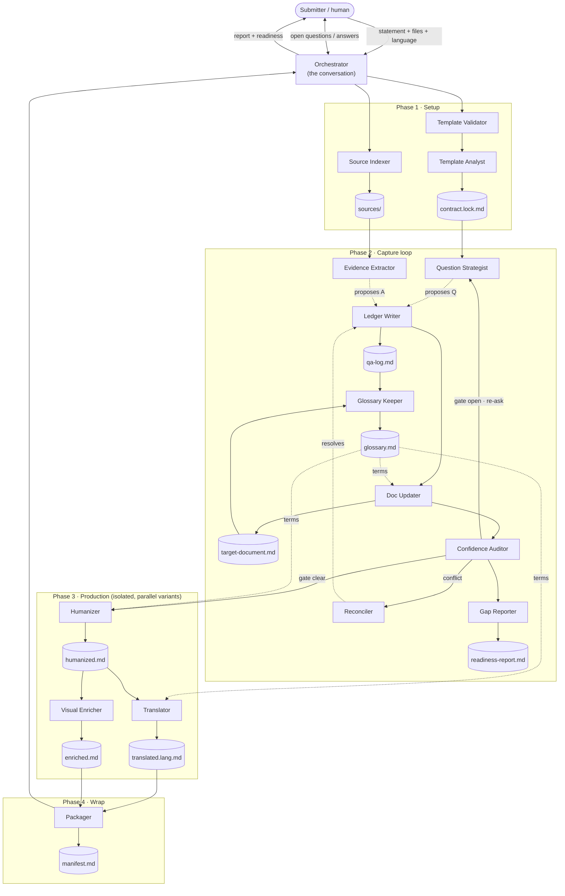

# Teamwork Process Marketplace

> The **`hsb-tech`** Claude Code plugin marketplace — and the development home of
> **`hsb-teamwork`**, a demand-to-delivery toolkit for Claude Code and Codex.

|                 |                                             |
|-----------------|---------------------------------------------|
| **Marketplace** | `hsb-tech`                                  |
| **Plugin**      | `hsb-teamwork` (v0.1.0)                     |
| **Author**      | Hugo Seabra                                 |
| **Repo**        | `hugo-hsbtech/teamwork-process-marketplace` |

This repository is two things at once:

1. **A plugin marketplace.** Its root holds [`.claude-plugin/marketplace.json`](.claude-plugin/marketplace.json),
   so anyone can add it to Claude Code and install the plugins it lists.
2. **The development home of the `hsb-teamwork` plugin** — its source, its Codex
   adapter, and a repo-level [eval suite](evals/) that tests the skills before
   release.

---

## What problem this solves

Most work dies in the gap between *someone has a request* and *a team can act on
it*. The request arrives as a sentence in a chat, a voice note, a half-filled
form — missing the problem framing, the people it affects, the reach, the impact.
Whoever picks it up either guesses or starts a long back-and-forth.

`hsb-teamwork` turns that raw signal into a **structured, confidence-graded
document** through a guided, multi-agent conversation. It asks only the gaps,
grounds every answer in evidence, marks what is still unknown honestly (rather
than blocking on it), and hands back a document a team can triage and plan
against — plus humanized, translated, and visually-enriched variants.

It is the origination stage of a larger **demand-to-delivery** model whose lineage
runs through Stage-Gate (Cooper), Dual-Track / Continuous Discovery (Cagan,
Torres), Theory of Constraints (Goldratt), Lean Software Development
(Poppendieck), Product Development Flow (Reinertsen), and Team Topologies
(Skelton & Pais). The plugin is where that model becomes a tool you can run.

---

## The `hsb-teamwork` plugin

A **multi-step toolkit**. Each step is a skill, invoked as `/hsb-teamwork:<skill>`
on Claude Code or `/hsb-teamwork-<skill>` on Codex.

| Step            | Skill                   | Status      |
|-----------------|-------------------------|-------------|
| Origination          | **`origination-brainstorm`** | ✅ available |
| Readiness       | `readiness-package`     | 🔜 planned  |
| Tech assessment | `tech-assessment`       | 🔜 planned  |
| PRD             | `prd-generation`        | 🔜 planned  |

Planned steps reuse the same agents and reference files, so the mechanics below
carry across the whole toolkit.

---

## The `origination-brainstorm` skill

Turns a raw Submitter description — a sentence, a paragraph, and/or referenced
files — into a fully-filled **target document**, through a confidence-driven
brainstorming loop, and then produces **humanized, translated, and
visually-enriched** variants. The document is defined by a **bundled, swappable
template**; the skill has **no dependency on any repository** and works in a fresh
project once installed.

### Two principles make it safe and parallel

1. **The template is the contract.** Each section of the target template carries a
   small annotation (`id`, `blocks`, `min-confidence`, `kind`) and a rubric. The
   pipeline fills every *blocking* section until it reaches its confidence
   threshold **X** or takes an honest disposition (`assumption` / `discovery` /
   `deferred`). *"I don't know, and here's the plan"* is valid readiness — uncertainty
   never blocks; it gets recorded.
2. **One writer per file.** Every mutable artifact has exactly one writer agent;
   every other agent is read-only and returns *proposals* the orchestrator routes
   to that single writer. Writes are serialized, queued, and merged
   (read-modify-write), so nothing is lost, clobbered, or truncated.

The conversation you have is with an **orchestrator** — the only layer that talks
to you. It does not fill the document itself; it collects information, spawns
specialized single-responsibility subagents, and routes their output, keeping its
own context lean by delegating the heavy work.

### The pipeline



- **Phase 1 — Setup:** the Validator checks the template; then the Source Indexer
  and Template Analyst run in parallel. The Analyst derives the contract and
  records the template hash (a changed hash restarts analysis).
- **Phase 2 — Capture loop:** the Strategist and Evidence Extractor *propose* in
  parallel; the Ledger Writer commits questions + answers; the Doc Updater fills
  the document; the Auditor re-scores and gates. Questions are tagged `open`
  (free-text prose, for pain/why gaps) or `choice` (interactive, scaffolded
  hypotheses with escape hatches). Conflicts go to the Reconciler; the Readiness
  Reporter shows the live gap map. The loop ends when every blocking section is
  ≥ X or honestly disposed.
- **Phase 3 — Production:** the Humanizer writes the clean canonical copy; then
  the Translator and Visual Enricher run in parallel as independent variants.
- **Phase 4 — Wrap:** the Packager writes a manifest indexing every artifact.

### The 16 agents (+ orchestrator)

The agents are named for the specialty they perform, not the phase they run in, so
the same roster serves origination-brainstorm, readiness-package, and the planned stages.
The names are identical on Claude and Codex (`hsb-<role>`).

| Phase | Agent                        | Role                                         |
|-------|------------------------------|----------------------------------------------|
| 1     | `hsb-template-validator`  | validates the template (read-only)           |
| 1     | `hsb-source-indexer`      | writes `sources/`, `sources-index.md`        |
| 1     | `hsb-template-analyst`    | writes `contract.lock.md` (+ hash / restart) |
| 2     | `hsb-question-strategist` | proposes next questions (read-only)          |
| 2     | `hsb-evidence-extractor`  | proposes answers from files (read-only)      |
| 2     | `hsb-reconciler`          | resolves evidence conflicts (read-only)      |
| 2     | `hsb-ledger-writer`       | writes `qa-log.md`                           |
| 2     | `hsb-doc-updater`         | writes the target document (`DOC`)           |
| 2     | `hsb-synthesizer`         | composes `derived` sections for the writer (read-only) |
| 2     | `hsb-glossary-keeper`     | writes the initiative's shared `glossary.md` + `decisions.md` |
| 2     | `hsb-gap-reporter`        | writes `readiness-report.md`                 |
| 2     | `hsb-confidence-auditor`  | re-scores + gate verdict (read-only)         |
| 3     | `hsb-humanizer`           | writes `output/humanized.md`                 |
| 3     | `hsb-translator`          | writes `output/translated.<lang>.md`         |
| 3     | `hsb-visual-enricher`     | writes `output/enriched.md`                  |
| 4     | `hsb-packager`            | writes `output/manifest.md`                  |

### Initiative artifacts

Work is organized into **initiatives**. A run resolves an initiative at
`<TEAMWORK_ROOT>/<YYYYMMDD>-<HHMM>-<project>-<hash6>/` (e.g.
`20260603-1833-pokerplan-a8432a`), where `TEAMWORK_ROOT` is `$TEAMWORK_HOME` or
your project's git root + `/.teamwork`. Each front runs as a **phase subfolder**
of the same initiative, so origination and readiness sit side by side:

```
<TEAMWORK_ROOT>/<YYYYMMDD>-<HHMM>-<project>-<hash6>/
├── initiative.json     # works + definitions index: status, phases, artifacts, readiness, owes
├── glossary.md         # shared canonical terms — one per initiative
├── decisions.md        # shared cross-phase decisions ledger
├── origination/        # the origination phase (PHASE_DIR)
│   ├── contract.lock.md     # derived contract + template hash
│   ├── sources-index.md     # index of ingested inputs
│   ├── sources/             # normalized input files
│   ├── qa-log.md            # the Q&A ledger (questions + rationale + answers)
│   ├── target-document.md   # the document being filled
│   ├── glossary.md          # brokered read-only copy of the shared glossary
│   ├── readiness-report.md  # live gap map
│   └── output/              # humanized · translated · enriched · manifest
└── readiness/          # the readiness phase (added when readiness-package runs)
    └── …
```

The **initiative is the unit of awareness.** `initiative.json` is an *index of
definitions and works*: per phase it records what was produced (the canonical
artifact paths), how ready it was, and what it still **owes** downstream (e.g. a
Technical Assessment). The shared `glossary.md` + `decisions.md` keep terms and
cross-phase decisions defined **once** — no per-phase drift. So a new front
(readiness today; tech-assessment / PRD next) becomes aware of *everything* prior
fronts defined and produced by reading one file, instead of crawling each phase or
hard-coding paths. The orchestrator owns these initiative-level files and **brokers**
them down to the phase agents (which stay scoped to their own phase folder).

**Re-running is safe.** A run resolves the open initiative (confirm the latest or
pick from the open list — closed ones are omitted) and **resumes** its phase —
answers are merged, never duplicated, and nothing is re-asked.

### Modes

- **Fresh** (default) — opening statement (+ files), build the document from zero.
- **Revisit** — point at an existing filled document; the Auditor re-scores it and
  questions re-open only on the weak sections.
- **Batch / headless** — a pile of raw signals and no live human; the no-question
  path (extract → fill → score) produces "draft for review" documents, one
  initiative per signal, in parallel.

> Deep dives: the skill's [README](plugins/hsb-teamwork/skills/origination-brainstorm/README.md)
> (architecture + diagrams), its [`SKILL.md`](plugins/hsb-teamwork/skills/origination-brainstorm/SKILL.md)
> (the orchestrator spec), and [`references/`](plugins/hsb-teamwork/skills/origination-brainstorm/references/)
> (the authoritative method files).

---

## Install & use

### Claude Code

```
/plugin marketplace add hugo-hsbtech/teamwork-process-marketplace
/plugin install hsb-teamwork@hsb-tech
/hsb-teamwork:origination-brainstorm
```

Then describe your demand in one line, optionally naming files to read. You can
also just describe a demand in normal chat — the skill triggers on
origination/capture/triage requests.

### Codex

Codex has no marketplace; you place a slash-command prompt, the 16 subagents, and
an `AGENTS.md` orchestrator. The Codex artifacts are vendor-prefixed (`hsb-*`)
because Codex uses a flat namespace; the names match the Claude agents one-to-one.

Full install steps for both tools, scopes, updating, and customizing the target
template: **[`plugins/hsb-teamwork/README.md`](plugins/hsb-teamwork/README.md)**.

---

## Evals

[`evals/`](evals/) is a **repo-level, dev/CI-only** harness (not shipped in the
plugin). It mirrors Claude's `skill-creator` eval loop: run each case headlessly
**with the skill** and as a **baseline**, then grade.

- **Layer 1 (automated, gating):** [`assertions.py`](evals/origination-brainstorm/assertions.py)
  checks the contract on the produced `target-document.md` — sentinel /
  no-truncation, every blocking section resolved-or-disposed, confidence lines,
  triage flagged draft.
- **Layer 2 (qualitative):** an LLM grades against [`rubric.md`](evals/origination-brainstorm/rubric.md)
  and the golden output.

```bash
cd evals/origination-brainstorm
./run.sh        # self-tests the grader; runs live cases if the `claude` CLI is present
```

The grader self-test runs without the `claude` CLI and passes on the golden at
100% readiness (4/4 blocking sections). See [`evals/README.md`](evals/README.md)
for the full loop.

---

## Repository layout

```
teamwork-process-marketplace/
├── .claude-plugin/
│   └── marketplace.json              # the hsb-tech marketplace manifest
├── plugins/
│   └── hsb-teamwork/                 # the plugin (self-contained)
│       ├── .claude-plugin/plugin.json
│       ├── README.md                 # install & use guide
│       ├── skills/origination-brainstorm/ # SKILL.md, README, references/, assets/
│       ├── agents/hsb-*.md           # 16 Claude subagents (phase-agnostic specialists)
│       └── codex/                    # Codex adapter (AGENTS.md, prompt, *.toml agents)
├── evals/                            # repo-level eval suite (dev/CI only)
│   └── origination-brainstorm/            # assertions.py, evals.json, rubric.md, run.sh, fixtures, golden
└── .claude/skills/                   # symlink into the plugin for local discoverability
```

The plugin is **self-contained** — its template, companion guide, and golden
exemplar are bundled under `assets/`, so no repository content is needed at
runtime. The `.claude/skills` symlink simply lets the skill run in-repo (for
evals and local use) without a second copy.

---

## Roadmap

- [x] `origination-brainstorm` — origination → filled, confidence-graded document + variants
- [ ] `readiness-package` — turn an origination into a delivery-ready package
- [ ] `tech-assessment` — technical feasibility and approach
- [ ] `prd-generation` — PRD from the accumulated context

---

## Author

Hugo Seabra · `contato.hsbtec@gmail.com`
