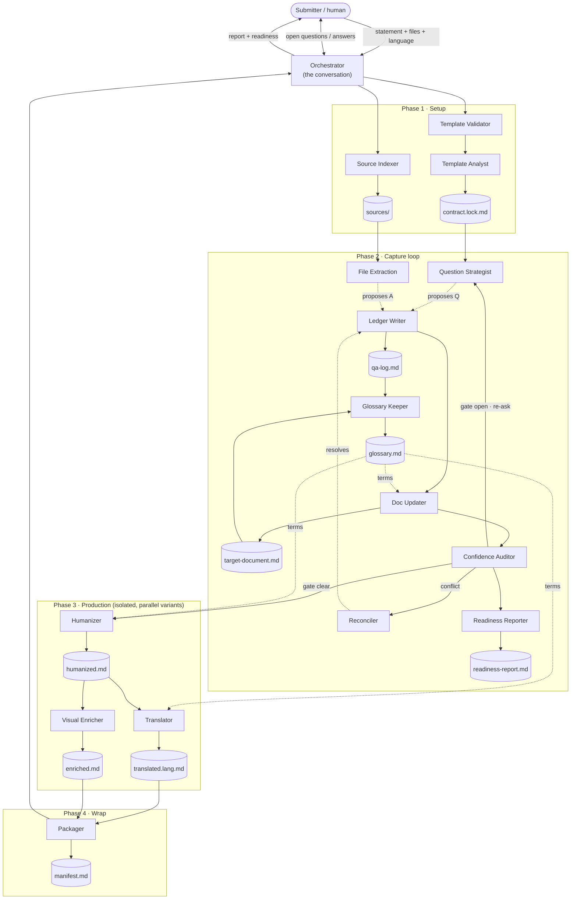
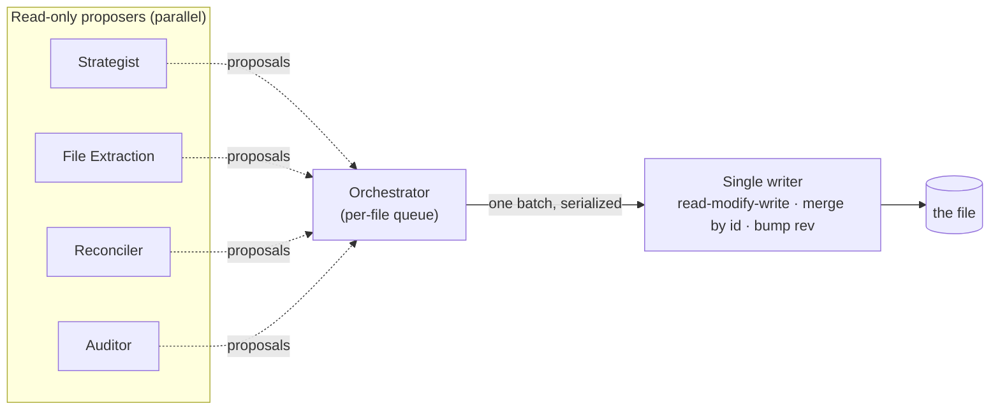

# intake-brainstorm

> **Part of the `hsb-teamwork` toolkit.** `intake-brainstorm` is the first skill,
> invoked as `/hsb-teamwork:intake-brainstorm`. Sibling steps are planned in the
> same plugin: `readiness-package`, `tech-assessment`, `prd-generation` — each a
> skill under `/hsb-teamwork:<skill>`, reusing this skill's agents and references.

A portable, user-scoped Claude skill that turns a raw Submitter description — a
sentence, a paragraph, and/or referenced files — into a fully-filled **target
document**, through a confidence-driven brainstorming loop, and then produces
**humanized, translated, and visually-enriched** variants.

The document it fills is defined by a **bundled, swappable template**; the skill
has **no dependency on any repository**, so it works in a fresh project once
installed.

> This README is the orientation. The authoritative specs live in
> [`SKILL.md`](SKILL.md) (the orchestrator) and [`references/`](references/).

## The big idea

The conversation you have with the skill is an **orchestrator** — the only layer
that talks to you. It does not fill the document itself. It **collects
information, spawns specialized single-responsibility subagents, and routes their
output**, keeping its own context lean by delegating heavy work.

Two principles make it safe and parallel:

1. **The template is the contract.** Each section of the target template carries a
   small annotation (`id`, `blocks`, `min-confidence`, `kind`) and a rubric. The
   pipeline fills every *blocking* section until it reaches its confidence
   threshold **X** or takes an honest disposition (`assumption` / `discovery` /
   `deferred`). "I don't know, and here's the plan" is valid readiness.
2. **One writer per file.** Every mutable artifact has exactly one writer agent;
   every other agent is read-only and returns *proposals* the orchestrator routes
   to that single writer. Writes are serialized, queued, and merged
   (read-modify-write), so nothing is lost, nothing is clobbered, and nothing is
   truncated.

## How it works



- **Phase 1 — Setup:** the Validator checks the template; then the Source Indexer
  and Template Analyst run in parallel. The Analyst derives the contract and
  records the template hash (a changed hash restarts the analysis).
- **Phase 2 — Capture loop:** the Strategist and File Extraction *propose* in
  parallel; the Ledger Writer commits questions + answers; the Doc Updater fills
  the document; the Auditor re-scores and gates. Each question is tagged `open`
  (free-text prose, for pain/why gaps) or `choice` (interactive `AskUserQuestion`
  with scaffolded hypothesis options + escape hatches, for categorical gaps and
  follow-up rounds) — see `references/questioning-method.md`. Conflicts go to the
  Reconciler; the Readiness Reporter shows the live gap map; the Glossary Keeper
  keeps terms consistent. The loop ends when every blocking section is ≥ X or
  honestly disposed.
- **Phase 3 — Production:** the Humanizer writes the clean canonical copy; then the
  Translator and Visual Enricher run in parallel as independent variants.
- **Phase 4 — Wrap:** the Packager writes a manifest indexing every artifact.

## The single-writer guarantee

Read-only proposers run in parallel and emit a stream of changes; the orchestrator
queues them and drains the queue through one writer per file.



If two changes target the same id incompatibly, the writer records both and the
Reconciler decides — it never silently overwrites. Every produced document ends
with a `<!-- END OF DOCUMENT -->` sentinel the Auditor checks, so truncation is
caught. Full rules: [`references/writing-integrity.md`](references/writing-integrity.md).

## The agents (15 + orchestrator)

| Phase | Agent | Reads / proposes or writes |
|---|---|---|
| 1 | `intake-template-validator` | validates the template (read-only) |
| 1 | `intake-source-indexer` | writes `sources/`, `sources-index.md` |
| 1 | `intake-template-analyst` | writes `contract.lock.md` (+ hash / restart) |
| 2 | `intake-question-strategist` | proposes next questions (read-only) |
| 2 | `intake-file-extraction` | proposes answers from files (read-only) |
| 2 | `intake-reconciler` | resolves evidence conflicts (read-only) |
| 2 | `intake-ledger-writer` | writes `qa-log.md` |
| 2 | `intake-doc-updater` | writes `target-document.md` |
| 2 | `intake-glossary-keeper` | writes `glossary.md` |
| 2 | `intake-readiness-reporter` | writes `readiness-report.md` |
| 2 | `intake-confidence-auditor` | re-scores + gate verdict (read-only) |
| 3 | `intake-humanizer` | writes `output/humanized.md` |
| 3 | `intake-translator` | writes `output/translated.<lang>.md` |
| 3 | `intake-visual-enricher` | writes `output/enriched.md` |
| 4 | `intake-packager` | writes `output/manifest.md` |

Agent definitions live in `.claude/agents/intake-*.md`.

## Session artifacts

A run creates one folder per demand:

```
<SESSION_ROOT>/<demand-slug>/      # SESSION_ROOT = $INTAKE_HOME or the project (git) root + /intake
├── contract.lock.md        # derived contract + template hash
├── sources-index.md        # index of ingested inputs
├── sources/                # normalized input files
├── qa-log.md               # the Q&A ledger (questions + rationale + answers)
├── target-document.md      # the document being filled
├── glossary.md             # canonical terms
├── readiness-report.md     # live gap map
└── output/                 # humanized · translated · enriched · manifest
```

## Modes

- **Fresh** (default) — opening statement (+ files), build the document from zero.
- **Revisit** — point at an existing filled document; the Auditor re-scores it,
  the gap map is reported, and questions re-open only on the weak sections.
- **Batch / headless** — a pile of raw signals and no live human; runs the
  no-question path (extract → fill → score) and produces "draft for review"
  documents, one session per signal, in parallel.

## Language

Detects the language of the opening statement and mirrors it for the conversation
and the captured document (default en-US). The Translator produces any additional
requested languages as separate `output/` files. Section *structure* is identical
across languages.

## Using it elsewhere

In **this repo** it already works — it is symlinked into `.claude/` from the
plugin, so no install step is needed here.

To reuse it in **other projects**, install it as a **Claude Code plugin** from
this repo's marketplace — versioned, namespaced, no copying:

```
/plugin marketplace add hugo-hsbtech/teamwork-process-marketplace
/plugin install hsb-teamwork@hsb-tech
```

(The plugin is published from its own repo; while still in the monorepo you can
add `hugo-hsbtech/teamwork-process` instead — same marketplace.json.)

Then invoke it as `/hsb-teamwork:intake-brainstorm` (plugin skills are
namespaced `<plugin>:<skill>`).

The plugin is self-contained (template, companion guide, and exemplar are bundled
under [`assets/`](assets/)), so no repository content is needed at runtime.

- **Codex**: see [`../../codex/README.md`](../../codex/README.md) — the same method
  files, an `AGENTS.md` orchestrator, an `/hsb-teamwork-intake-brainstorm` prompt, and the 15
  roles as Codex subagents (`hsb-intake-*.toml`), run sequentially under Codex's
  single-agent model.

To target a different document type, copy
`assets/target-template.intake-record.md`, re-annotate its sections, and pass it
as the template.

## Layout (the plugin)

```
plugins/hsb-teamwork/        # the Claude Code plugin (self-contained)
├── .claude-plugin/plugin.json
├── skills/intake-brainstorm/
│   ├── SKILL.md                       # orchestrator spec
│   ├── README.md                      # this file
│   ├── references/
│   │   ├── orchestration.md           # phases, roster, single-writer rule
│   │   ├── contract-and-template.md
│   │   ├── ledger-schema.md
│   │   ├── questioning-method.md
│   │   ├── writing-integrity.md       # no-truncation + queue/merge/conflict
│   │   ├── sessions.md                # resolve-or-resume, cross-run idempotency
│   │   └── grounding.md
│   └── assets/
│       ├── target-template.intake-record.md
│       ├── target-template.intake-record.guide.md
│       └── golden-example.md
├── agents/intake-*.md                 # 15 Claude subagents (plugin-namespaced)
└── codex/                             # Codex adapter (reuses the files above)
    ├── AGENTS.md
    ├── prompts/hsb-teamwork-intake-brainstorm.md
    └── agents/hsb-intake-*.toml        # 15 Codex subagents (flat namespace -> prefixed)
```

The repo root holds `.claude-plugin/marketplace.json`, and `.claude/skills` +
`.claude/agents` are symlinks into this plugin so it also works in-repo without a
second copy.
